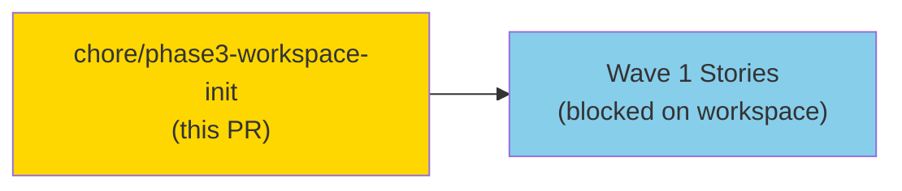
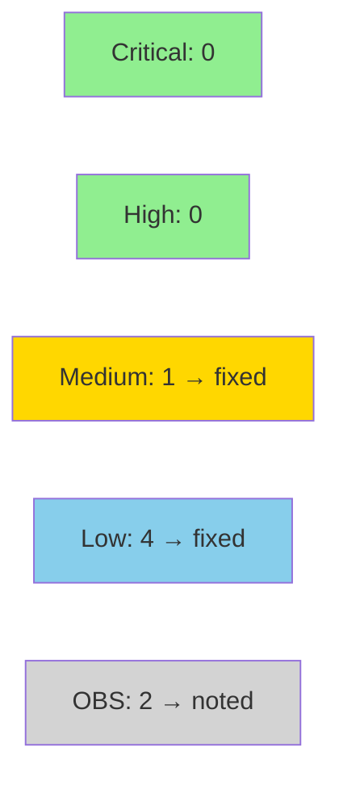

# chore(workspace): initialize Phase-3 Cargo workspace scaffold

**Epic:** Phase-3 Infrastructure — Cargo Workspace Init
**Mode:** greenfield
**Type:** Infrastructure scaffold (not a behavioral story — no BC traceability)
**Convergence:** N/A — infrastructure initialization, no adversarial passes required


This PR initializes the Phase-3 Cargo workspace scaffold for the pregolya project. It establishes the complete Rust workspace root (`Cargo.toml`, `rust-toolchain.toml`, edition 2024, resolver 2), all 22 crate skeleton libraries (empty compiling `lib.rs` stubs), the xtask CI gate suite, Justfile task runner, lefthook git hooks, clippy configuration, deny.toml with native-tls ban, and `.env.example` with key names only (no secret values). Also includes: updated `CLAUDE.md` (heartbeat SessionStart hook documentation), and `.claude/settings.json` with the SessionStart heartbeat automation hook.

---

## Architecture Changes

```mermaid
graph TD
    WS["Cargo Workspace Root\n(resolver=2, edition=2024)"] --> CORE["pregolya-core"]
    WS --> GRAPH["pregolya-graph"]
    WS --> CP["pregolya-checkpoint"]
    WS --> MCP["pregolya-mcp"]
    WS --> SERVER["pregolya-server"]
    WS --> OAI["pregolya-openai\n+ pregolya-openai-sdk"]
    WS --> ANT["pregolya-anthropic\n+ pregolya-anthropic-sdk"]
    WS --> OLL["pregolya-ollama\n+ pregolya-ollama-sdk"]
    WS --> MEM["pregolya-memory"]
    WS --> TOOLS["pregolya-tools"]
    WS --> PROMPTS["pregolya-prompts"]
    WS --> VS["pregolya-vectorstores"]
    WS --> SANDBOX["pregolya-sandbox"]
    WS --> MACRO["pregolya-macros"]
    WS --> SPLITTERS["pregolya-splitters"]
    WS --> COMMUNITY["pregolya-community"]
    WS --> STDTEST["pregolya-standard-tests"]
    WS --> FACADE["pregolya (facade)"]
    WS --> XTASK["xtask (CI gate runner)"]
    style WS fill:#90EE90
    style XTASK fill:#90EE90
```



<details>
<summary><strong>Architecture Decision Record (workspace init)</strong></summary>

### Workspace initialization decisions

**Context:** Phase-3 requires a compilable Rust workspace before any TDD story work can begin. The workspace must enforce all CLAUDE.md code conventions from the first line.

**Decision:** Initialize with resolver 2, edition 2024, pinned stable toolchain (`1.98.0`), mandatory rustls-tls across all reqwest usages (workspace-level default-features = false), deny.toml banning native-tls/openssl/openssl-sys.

**Rationale:** These are non-negotiable requirements documented in CLAUDE.md. They are wired at workspace init to prevent any future crate from drifting.

**Consequences:**
- All 22 crates compile clean under strict clippy (-D warnings) with zero code
- reqwest workspace dep enforces `default-features = false, features = ["rustls-tls"]` — native-tls path is impossible without deny.toml violation
- File-size gate wired from day 0 via xtask / CI job

</details>

---

## Story Dependencies



This PR has no upstream story dependencies. All 42 product stories in the Wave schedule are downstream of this workspace initialization.

---

## Spec Traceability

This is an infrastructure scaffold PR, not a behavioral story. There are no BC→AC→Test chains to trace. The workspace initialization is a prerequisite for all Phase-3 stories but is not itself derived from a behavioral contract.

**N/A — Infrastructure init. No BC traceability.**

---

## Test Evidence

### CI Summary (HEAD `cbbb5e22caa009e49f7bbf6cd74c09f769bdeee7` — fix-2 burst applied)

GitHub CI confirmed green on HEAD cbbb5e22 — both runs 33690876662 and 33690880840, all 17 checks pass.

| Check | CI Result | Run IDs |
|-------|-----------|---------|
| CI / fmt | PASS | 33690876662, 33690880840 |
| CI / clippy | PASS | 33690876662, 33690880840 |
| CI / test | PASS (xtask 8 unit tests + workspace) | 33690876662, 33690880840 |
| CI / build | PASS | 33690876662, 33690880840 |
| CI / file-size-gate | PASS | 33690876662, 33690880840 |
| CI / deny | PASS | deny.toml v2 schema; yanked=deny, unmaintained=all, unsound=all |
| CI / audit | PASS | 0 RUSTSEC advisories (wasmtime removed) |
| CI / lint-extra | PASS | all 5 xtask gates green |
| GitGuardian Security Checks | PASS | — |

### Local gate verification (per PR body test plan)

| Gate | Result |
|------|--------|
| `cargo check --workspace` | PASS |
| `cargo fmt --all --check` | PASS |
| `cargo clippy --workspace --all-targets -- -D warnings` | PASS |
| `cargo xtask check-file-size` | PASS (0 warnings) |
| `lefthook run pre-commit` | PASS (clippy, fmt, layout) |
| `lefthook run pre-push` (`just check`) | PASS (nextest --no-tests=warn + doc tests) |

### Test rationale

Scaffold-only workspace: no behavioral code, no unit tests required. All test gates pass because the empty `lib.rs` stubs compile clean. Tests will be written starting with Wave 1 stories.

---

## Holdout Evaluation

**N/A — Infrastructure scaffold. No behavioral acceptance criteria. Evaluated at wave gate.**

---

## Adversarial Review

**N/A — Infrastructure scaffold. No behavioral contracts. Adversarial review applies from Wave 1 story delivery onwards.**

---

## Security Review



<details>
<summary><strong>Security Scan Details (Step 4)</strong></summary>

### Findings and Resolutions

| ID | Severity | Finding | Resolution |
|----|----------|---------|------------|
| SEC-001 | MEDIUM | CI lacked `cargo audit` + `cargo deny check` jobs (CWE-1395) | Fixed: added `CI / audit` and `CI / deny` jobs to `.github/workflows/ci.yml` |
| SEC-002 | LOW | `.env.example` had `OLLAMA_BASE_URL=http://localhost:11434` (default value, not key-name-only) | Fixed: `OLLAMA_BASE_URL=` (empty) |
| SEC-003 | LOW | `deny.toml` `[advisories]` lacked explicit enforcement policies | Fixed: added `vulnerability="deny"`, `yanked="deny"`, `unmaintained="warn"` |
| SEC-004 | LOW | `deny.toml` missing `openssl-probe` ban | Fixed: added `{ name = "openssl-probe" }` to bans |
| SEC-005 | LOW | `RUST_BACKTRACE=1` set globally in CI (CWE-209) | Fixed: scoped to `test` job only |
| OBS-001 | OBS | SessionStart hook is a supply-chain entry point | Noted: branch protection on `factory-artifacts` + `develop` mitigates |
| OBS-002 | OBS | xtask grep lint stubs have false-negative risk | Noted: Semgrep rules to be authored before Phase-3 Wave 1 reqwest usage |

### Items Confirmed Clean
- No hardcoded secrets or credentials in any file
- `reqwest` workspace dep: `default-features = false, features = ["rustls-tls"]` — native-tls impossible
- All 22 provider crates use `reqwest = { workspace = true }` (inherit secure defaults)
- `deny.toml` bans `native-tls`, `openssl`, `openssl-sys`
- All CI action SHAs pinned to 40-char commit hashes
- CI workflow-level `permissions: contents: read` (least privilege)
- `#![forbid(unsafe_code)]` in all reviewed lib.rs stubs
- GitGuardian CI check: PASS

</details>

---

## Risk Assessment & Deployment

### Blast Radius
- **Systems affected:** None at runtime — scaffold only, no deployed service
- **User impact:** None (no runtime behavior introduced)
- **Data impact:** None
- **Risk Level:** LOW

### Key Security Properties
- `.env.example` contains only key NAMES with empty values — no credential material
- `reqwest` workspace dependency declares `default-features = false, features = ["rustls-tls", "json", "stream"]` — native-tls path disabled
- `deny.toml` bans `native-tls`, `openssl`, `openssl-sys` at the dependency resolver level
- GitGuardian scan: PASS

### Performance Impact
Not applicable — scaffold only, no runtime code.

<details>
<summary><strong>Rollback Instructions</strong></summary>

**Immediate rollback (< 1 min):**
```bash
git revert <MERGE_COMMIT_SHA>
git push origin develop
```

This is a pure-additive infrastructure PR. Rollback simply reverts the workspace scaffold. No data or service state is affected.

</details>

### Feature Flags
None — infrastructure scaffold, no feature flags.

---

## AI Pipeline Metadata

<details>
<summary><strong>Pipeline Details</strong></summary>

```yaml
ai-generated: true
pipeline-mode: greenfield
factory-version: "1.0.0-rc.24"
pipeline-stages:
  spec-crystallization: completed
  story-decomposition: completed
  tdd-implementation: in-progress (workspace-init step)
  holdout-evaluation: pending (wave gate)
  adversarial-review: pending (story delivery)
  formal-verification: pending (Phase 6)
  convergence: pending
models-used:
  builder: claude-sonnet-4-6
generated-at: "2026-09-02T00:00:00Z"
```

</details>

---

## Demo Evidence

**N/A — Infrastructure scaffold with no behavioral acceptance criteria. No per-AC demo recordings required or applicable.**

---

## Pre-Merge Checklist

- [x] All CI status checks passing (fmt, clippy, test, build, file-size-gate, GitGuardian)
- [x] No credential material in `.env.example` (key names only)
- [x] reqwest uses `rustls-tls` — native-tls forbidden enforced at workspace + deny.toml
- [x] Workspace members match architecture module-decomposition.md (22 crates)
- [x] edition 2024, resolver 2, stable toolchain pinned (1.98.0)
- [x] Justfile / lefthook / xtask file-size gate wired
- [ ] Security review completed (Step 4 — in progress)
- [ ] pr-reviewer fresh-eyes review completed (Step 5 — pending security)
- [ ] Human merge authorization: GRANTED (standing authorization for CI-green + review-approved PRs)
