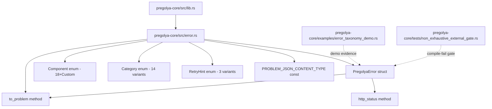
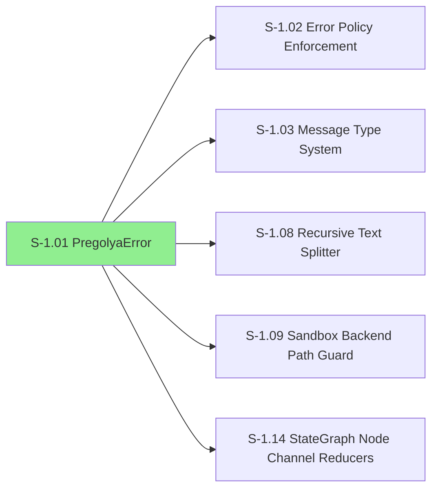
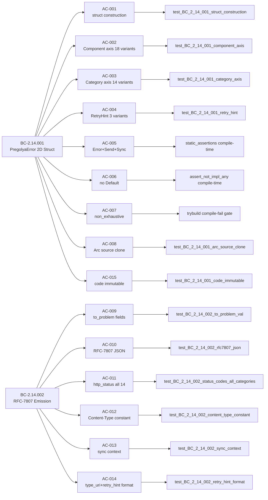

## S-1.01 — PregolyaError 2D Struct and RFC-7807 Emission

**Story:** S-1.01 | **Wave:** 1 | **Priority:** P0 | **Crate:** `pregolya-core`
**BCs:** BC-2.14.001, BC-2.14.002 | **Dependencies:** none (root story) | **Blocks:** S-1.02, S-1.03, S-1.08, S-1.09, S-1.14

---

### Summary

Implements the universal `PregolyaError` struct — the foundational error type for all pregolya family crates.
Every error carries two orthogonal dimensions: a `Component` axis (18 named variants + `Custom(String)` = 19 total) and a `Category` axis (14 variants including `Category::Sys`). Each error also carries a `RetryHint` (Never/Maybe/Later), a stable machine-readable `code` string (`E-<COMPONENT>-<NNN>`), a human message, and an `Option<Arc<dyn Error + Send + Sync>>` source chain.

`to_problem()` produces an RFC-7807 `ProblemDetail` safe for HTTP responses: `type_uri` (`urn:pregolya:error:<code>`), humanized `title`, `detail`, top-level `retry_hint` (canonical `"never"/"maybe"/"later:<secs>"`), and top-level `component` (lowercase identifier per RFC-7807 §3.2). `PROBLEM_JSON_CONTENT_TYPE` (`"application/problem+json"`) is exported as a constant.

The entire module is pure-core: no Tokio dependency, no I/O, deterministic.

---

### Architecture Changes



**Files changed:**
- `crates/pregolya-core/src/error.rs` — CREATE — `PregolyaError`, `Component` (18+Custom), `Category`, `RetryHint`, `ProblemDetail` (5 top-level fields), `PROBLEM_JSON_CONTENT_TYPE`, `to_problem()`, `http_status()`
- `crates/pregolya-core/src/lib.rs` — MODIFY — `pub mod error;` + re-exports (5 public types: `PregolyaError`, `Component`, `Category`, `RetryHint`, `ProblemDetail`)
- `crates/pregolya-core/examples/error_taxonomy_demo.rs` — CREATE — per-AC demo evidence (taxonomy-faithful error codes)
- `crates/pregolya-core/tests/non_exhaustive_external_gate.rs` — CREATE — compile-fail/pass gate for all 5 `#[non_exhaustive]` public types
- `crates/pregolya-core/tests/ui/*.rs` — CREATE — 10 trybuild UI test files (5 fail-cases + 5 pass-cases)

---

### Story Dependencies



S-1.01 has **no upstream dependencies** (root story, Wave 1). It blocks 5 downstream stories.

---

### Spec Traceability



---

### Test Evidence

| Metric | Value |
|--------|-------|
| Tests passing | 49 / 49 |
| ACs covered | 15 / 15 |
| AC-to-test mapping | Complete (all ACs traced to named tests) |
| Compile-time gates | `static_assertions::assert_impl_all!` (Error+Send+Sync), `assert_not_impl_any!` (Default) |
| Compile-fail gates | 10 trybuild UI tests (5 fail-cases + 5 pass-cases for all 5 `#[non_exhaustive]` types) |
| LOCAL adversary 3-CLEAN | Converged at frozen HEAD 1443d3d (3 consecutive CLEAN(strict) passes) |
| PR-HEAD commit | fix-burst-10c: SEC-001 debug_assert→assert for Custom name validation (final HEAD before PR #2 merge) |

**Test command (CI-equivalent):**
```
cargo test --workspace --all-features
cargo clippy --workspace --all-targets --all-features -- -D warnings
cargo fmt --all -- --check
cargo xtask check-file-size
```

---

### Demo Evidence — S-1.01: PregolyaError

| AC Group | GIF |
|----------|-----|
| Construction, Display, Arc Source Chain (AC-001/007/008) |  |
| Enum Axes & RetryHint (AC-002/003/004) |  |
| RFC-7807, http_status, Content-Type, Sync, Immutable (AC-009..015) |  |

Demo recorded by: `cargo run -p pregolya-core --example error_taxonomy_demo -- <section>`
Recording tool: VHS 0.11.0

---

### Holdout Evaluation

N/A — evaluated at wave gate (Phase 4, Wave 1).

---

### Adversarial Review

LOCAL cascade converged at frozen HEAD 1443d3d (3 consecutive CLEAN(strict) passes, passes 2-4).

PR-level adversarial cascade (BC-5.39.001, streak target 3 consecutive CLEAN(strict)):

| Pass | HEAD | CLEAN(strict) | CLEAN(PR-merge) | Streak | Key Findings |
|------|------|---------------|-----------------|--------|--------------|
| 1 | 80f93e6 | no | no | 0/3 | with_source() missing (HIGH), ADR-010 13 cats (HIGH), 4 MED |
| 2-7 | various | no | no | 0/3 | SS mis-anchors, source private, RetryHint defaults, RFC-7807 flatten decision |
| 8 | 6e8ef84 | no | no | 0/3 | Collision debug_assert wrong, ProblemExtensions option ii, extensions.* sweep |
| 9 | fix-burst-8 head | no | no | 0/3 | NAMED_COMPONENT_LOWERCASE sync (doc-comment-only), Custom charset validation |
| 10 | fix-burst-8 head | no | no | 0/3 | error-taxonomy.md RFC-7807 mapping table, PR description stale |
| 10 fixes | fix-burst-10c | — | — | — | Doc sweep, sync assertion, demo taxonomy fix, SEC-001 debug_assert→assert, BC/ADR factory amendments |
| 11 | fix-burst-10c head | no | no | 0/3 | F1 emit-time guard bypassable, F2 code-format assert inconsistency, F3 cfg gate, F4 VP traceability, F5 gate registration |
| 11 fixes | fix-burst-11 | — | — | — | Emit-time guard, assert consistency, cfg gates, fixture registration, VP frontmatter, AC fixes, BC DI-010 |
| 12 | fix-burst-11 head | no | no | 0/3 | MED-1: # Panics rustdoc missing; to_problem() says "Safe to call"; LOW-1: BC EC-002 prose stale; LOW-2: test fixture taxonomy codes |
| 12 fixes | fix-burst-12 | — | — | — | # Panics docs on new/to_problem/component_lowercase; test fixture synthetic codes; BC EC-002 prose |
| 13 | fix-burst-12 head | no | no | 0/3 | MED-1: ADR-010 §Decision 26 D26/SYS gate subsections stale sibling gap; LOW-1: # Panics "uppercase" wrong |
| 13 fixes | fix-burst-13 | — | — | — | ADR-010 §Decision 26 D26/SYS subsections historical; rustdoc # Panics casing |

**Cascade complete** — PR #2 merged (develop HEAD 086c0dc); passes 17/18/19 CLEAN(strict) confirmed.

---

### Security Review

Reviewed at fix-burst-10c HEAD (final HEAD before PR #2 merge; see PR #2 security-reviewer dispatch).
**Verdict: PASS** — 0 CRITICAL, 0 HIGH, 0 MED. ADR-010 MUST NOT (source chain absent from HTTP responses) confirmed regression-tested.

| ID | Severity | CWE | Title | Status |
|----|----------|-----|-------|--------|
| SEC-001 | MED→CLOSED | CWE-20 | `debug_assert!` for Custom name validation stripped in `--release` | MITIGATED — fix-burst 10c: `assert!` fires in all build modes |
| SEC-002 | LOW | CWE-209 | `message` field accepts arbitrary string (no credential enforcement) | Accepted — pre-implementation gate for pregolya-openai/anthropic provider stories |
| SEC-003 | LOW | CWE-532 | `#[derive(Debug)]` message field in log output (activates with provider error types) | Accepted — pre-implementation gate for Wave 1 provider crates |

`#![forbid(unsafe_code)]` confirmed. `to_problem()` source-chain isolation confirmed. No `reqwest` dependency in `pregolya-core` (pure types crate).

---

### Risk Assessment

| Dimension | Assessment |
|-----------|------------|
| Blast radius | Pure-core library module; no runtime effects, no I/O |
| Performance impact | None — pure data construction + serialization |
| Breaking change risk | `#[non_exhaustive]` on all public types; downstream crates cannot be broken by variant additions |
| Credential leakage risk | None — `source` field is `Option<Arc<dyn Error+Send+Sync>>`; `ProblemDetail` omits source chain; no credential types in this module |
| Dependency additions | `static_assertions`, `anyhow`, `trybuild` (all dev-dependencies only) |

---

### AI Pipeline Metadata

| Field | Value |
|-------|-------|
| Pipeline mode | greenfield + semport |
| Model | claude-sonnet-4-6 |
| Story points | 5 |
| Estimated days | 1 |
| Wave | 1 |
| Phase | 3 (TDD Implementation) |

---

### Pre-Merge Checklist

- [x] PR created with structured description
- [x] Demo evidence present (3 recordings, all 15 ACs covered)
- [x] LOCAL adversarial 3-CLEAN converged (frozen HEAD 1443d3d)
- [ ] Security review complete
- [ ] PR-LEVEL adversarial 3-CLEAN converged
- [ ] CI green (fmt + clippy + test + build + file-size-gate)
- [ ] PR reviewer APPROVE
- [ ] Dependency check: S-1.01 has no upstream deps — gate trivially passes
