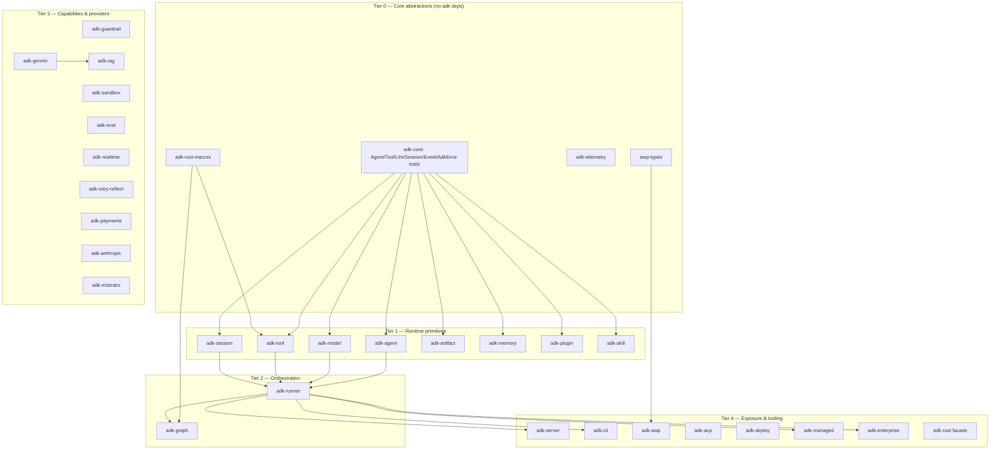

# adk-rust — Module Inventory (Pass A1)

39 workspace crates with implementation directories + 1 declared-only stub (`adk-studio` appears in Cargo.toml `members` list but has no directory on disk) = 40 Cargo.toml members total [comparative-sweep: `grep -E '^\s+"[a-z]' Cargo.toml | grep -v examples|reference|learning | wc -l` → 40; `adk-studio` dir absent]. 81 example crate directories in `examples/` (3 are workspace members; 78 are standalone with their own `[workspace]` key). `resolver = "2"`, `edition = "2024"`,
`rust-version = "1.94.0"`. LOC below = scc `Code` metric (comments/blanks excluded),
measured per-crate at the workspace tag; examples excluded. Whole-repo code total per
the reference manifest is 265,316 (includes examples); the 39 in-workspace crates sum
to ~242k code-lines.

## Workspace Scale Table (by LOC, descending)

| Crate | Code LOC | .rs files | Layer | Purpose (one line) |
|-------|---------:|----------:|-------|--------------------|
| adk-model | 27,913 | 100 | Integration | 10 LLM provider adapters (openai, anthropic, gemini, bedrock, azure_ai, deepseek, groq, ollama, openrouter, openai_compatible) + retry/usage/tool-call parsing |
| adk-server | 20,752 | 72 | Infra | HTTP/REST + A2A v1.0.0 JSON-RPC protocol, SSE streaming, task store, push notifications |
| adk-anthropic | 17,263 | 133 | Provider | First-party Anthropic Claude integration (standalone, distinct from adk-model/anthropic) |
| adk-payments | 14,485 | 74 | Capability | Agentic commerce: ACP + AP2 protocol baselines, payment kernel, journal, guardrails |
| adk-gemini | 14,141 | 96 | Provider | First-party Google Gemini integration (client, streaming, interactions API) |
| adk-tool | 10,846 | 57 | Runtime | Tool trait ecosystem: function tools, MCP client/manager, builtin tools, toolsets, code-exec |
| adk-graph | 10,709 | 55 | Capability | LangGraph-style graph orchestration: nodes, edges, reducers, checkpointing, HITL, streaming |
| adk-agent | 9,398 | 41 | Runtime | Agent implementations: LlmAgent + workflow agents (sequential/parallel/loop/conditional) + ambient |
| adk-session | 8,089 | 32 | Runtime | Session persistence: 8 backends + encryption wrapper + migration + rewind/time-travel |
| adk-audio | 8,029 | 78 | Capability | Audio processing utilities (formats, resampling, VAD support) |
| adk-mistralrs | 7,814 | 32 | Provider | Local LLM inference via mistralrs |
| adk-realtime | 7,737 | 56 | Capability | Real-time bidi voice/video agents (OpenAI Realtime, Gemini Live, LiveKit) |
| adk-core | 7,420 | 28 | Core | Foundational traits + types: Agent, Tool, Llm, Session, Event, AdkError, contexts |
| adk-runner | 6,208 | 25 | Runtime | Agent execution runtime: session orchestration, transfer loop, cache/compaction lifecycle |
| adk-managed | 6,160 | 23 | Infra | Managed agent runtime |
| adk-code | 5,754 | 25 | Capability | Code execution capabilities |
| adk-enterprise | 5,675 | 32 | Infra | Enterprise client SDK |
| adk-eval | 5,738 | 26 | Capability | Agent evaluation framework (trajectory + response-quality metrics, .test.json) |
| adk-auth | 4,838 | 36 | Infra | Authentication helpers + secret providers (AWS/Azure/GCP behind features) |
| adk-bench | 4,828 | 13 | Tooling | Benchmarking framework |
| adk-sandbox | 4,826 | 27 | Capability | Isolated code execution (process backend + wasmtime WASM backend) |
| adk-memory | 4,568 | 18 | Runtime | Semantic memory + search; project-scoped isolation |
| cargo-adk | 4,050 | 11 | Tooling | `cargo adk` subcommand |
| adk-browser | 3,863 | 18 | Capability | Browser automation integration |
| adk-cli | 2,128 | 11 | Tooling | CLI binary |
| adk-acp | 2,079 | 21 | Protocol | Agent Client Protocol (connect to Claude Code/Codex; expose ADK as ACP) |
| adk-awp | 2,071 | 17 | Protocol | Agentic Web Protocol impl (discovery, manifest, trust, consent, rate-limit, webhooks) |
| adk-plugin | 2,019 | 9 | Runtime | Plugin lifecycle-hook system (before/after run, message, event, model, tool) |
| adk-rag | 1,921 | 19 | Capability | RAG pipeline: embeddings, vector stores, chunking, reranking (feature-gated backends) |
| adk-action | 1,880 | 6 | Capability | Action nodes |
| adk-skill | 1,728 | 9 | Runtime | Skill registry (agentskills.io standard; .skill.md discovery, persona selection) |
| adk-deploy | 1,605 | 7 | Infra | Deployment helpers |
| awp-types | 1,171 | 12 | Protocol | Pure AWP wire types, zero adk-* deps |
| adk-artifact | 969 | 6 | Runtime | Artifact storage/retrieval |
| adk-telemetry | 888 | 7 | Infra | OpenTelemetry tracing/metrics facade + macros |
| adk-guardrail | 797 | 7 | Capability | Safety/content policy: content filter, PII redaction, schema validation |
| adk-rust-macros | 754 | 2 | Core | Procedural macros (#[tool], graph #[entrypoint]/#[task]) |
| adk-rust | 681 | 3 | Core | Re-export facade crate |
| adk-retry-reflect | 575 | 11 | Capability | Retry-with-reflection plugin: injects reflection prompts on tool failure |

## Layering Story ("core → runtime → integration")

adk-rust exhibits a disciplined 5-tier layering with `adk-core` as a pure-abstraction hub:



Observations grounding the layering claim (not conclusions):
- **`adk-core` has zero intra-workspace dependencies** and defines every load-bearing trait
  (`Agent`, `Tool`, `Llm`, `Session`, `State`, `Memory`, `Artifacts`, `SecretService`,
  `ToolContext`, `InvocationContext`, `SchemaAdapter`, `ToolRegistry`, `Toolset`,
  `CacheCapable`) plus the unified `AdkError`. This is the hub.
- **`adk-model` depends on `adk-core` and `adk-telemetry`** (via the `adk_telemetry::warn!`
  macro seen in retry.rs) but NOT on adk-agent/runner — providers are leaf integrations.
- **Provider duplication is deliberate**: `adk-model` contains an in-tree `anthropic/` and
  `gemini/` module family, while `adk-anthropic` (17k LOC) and `adk-gemini` (14k LOC) are
  *separate* first-party crates. Two provider surfaces for the same vendors coexist —
  a scope anomaly worth flagging (see patterns-observed WEAK-2).
- **`adk-runner` is the composition root**: it wires `Arc<dyn Agent>`, `Arc<dyn SessionService>`,
  `Option<Arc<dyn ArtifactService>>`, `Option<Arc<dyn Memory>>`, `Option<Arc<PluginManager>>`,
  `Option<Arc<dyn CacheCapable>>` behind feature flags (`artifacts`, `plugins`, `skills`,
  `context-compaction`). Arc-DI throughout.
- **Feature-flag gating is pervasive** — runner, model, agent, cli, mistralrs, managed all
  declare `default-features = false` in the workspace dependency table, indicating an
  intentional opt-in composition model rather than a monolith.

## Entry Points
- `adk-rust` (facade) — re-export surface for downstream consumers.
- `adk-cli` / `cargo-adk` — binaries.
- `adk-server::create_app` / `create_app_with_a2a` — HTTP entry.
- `adk_runner::Runner::builder()` — programmatic agent execution entry (typestate builder).

## Note-Only Inventory of the Rest (one paragraph each; deep passes follow)

**adk-graph** — LangGraph-analog. Directed-graph workflows with cyclic support, conditional
routing (dynamic `route` field on `EventActions`), typed state with reducers (overwrite/
append/sum/custom), per-step checkpointing, human-in-the-loop interrupts (before/after node
+ dynamic), and multiple stream modes (values/updates/messages/debug). A `functional` feature
adds `#[entrypoint]`/`#[task]` macros with automatic checkpointing and typed state reducers
(ReducedValue, UntrackedValue, MessagesValue). Directly maps to ferrochain-graph concern
(semport/graph). 14 integration-test files (3,185 LOC).

**adk-memory** — Semantic long-term memory with an in-memory service and a `MemoryService`
trait for custom backends. Distinctive feature: project-scoped isolation keyed by
`(app_name, user_id, project_id?)` with global vs project-scoped visibility rules and a
`MemoryServiceAdapter` bridging to `adk_core::Memory`. Maps to langchain-core §8
(Retrievers/VectorStores) concern.

**adk-server** — HTTP infrastructure built on axum, implementing the full A2A (Agent-to-Agent)
Protocol v1.0.0 with all 11 JSON-RPC operations behind an `a2a-v1` feature: RFC-3339
timestamps, message-ID idempotency, push-notification auth (Bearer + notification token),
INPUT_REQUIRED multi-turn resume, version negotiation via `A2A-Version` header, and SSE
streaming. Uses external `a2a-protocol-types` for wire types. 13 test files (4,906 LOC).

**adk-guardrail** — Input/output validation running in parallel with agent execution.
Ships `ContentFilter` (harmful/off-topic blocking), `PiiRedactor` (emails/phones/SSNs),
optional `SchemaValidator` (feature `schema`), a `GuardrailSet`/`GuardrailExecutor` composition
model, and a `Severity` enum. Notably has **zero integration-test files** (unit tests only) —
flagged for deep pass. Maps to ferrochain safety/NFR concern.

**adk-sandbox** — Isolated code execution behind a `SandboxBackend` trait with two impls:
`ProcessBackend` (default; `tokio::process::Command`, timeout + env isolation, but explicitly
NOT memory/network isolation) and `WasmBackend` (feature `wasm`; wasmtime in-process with
timeout + memory-limit + full no-fs/no-net sandboxing). Honest documentation of isolation
guarantee gaps. 7 test files (1,091 LOC).

**adk-eval** — Evaluation framework with structured `.test.json` test definitions, trajectory
evaluation (tool-call-sequence validation), and response-quality metrics (ground-truth,
rubric-based, LLM-judged). `tool_trajectory_score` and `response_similarity` criteria. Only
2 integration-test files (234 LOC) despite being an eval framework — flagged.

**adk-realtime** — Bidirectional real-time voice/video agents implementing the `adk_core::Agent`
trait via `RealtimeAgent` (parallel to LlmAgent). Multiple providers (OpenAI Realtime API,
Gemini Live API), audio streaming (PCM16, G711), server-side VAD, real-time tool calling.
LiveKit dependency with `native-tls` (contrast with workspace rustls default — noted for
dependency-disposition). 53 `.wav` test fixtures in the corpus likely live here or adk-audio.

**providers (adk-gemini / adk-anthropic / adk-mistralrs)** — First-party model integrations
as standalone crates, separate from adk-model's in-tree provider modules. adk-anthropic is
133 files / 17k LOC — the second-largest provider surface. adk-gemini implements both the
generateContent transport and the Interactions API (server-managed tool loop, `interaction_id`
chaining seen in adk-core::model). mistralrs is local inference.

**protocols (awp-types / adk-awp / adk-acp)** — Three protocol families. `awp-types` is a
dependency-free pure-wire-types crate (TrustLevel, RequesterType, A2aMessage, discovery/
manifest types) using camelCase serde. `adk-awp` is the full Agentic Web Protocol server
(TOML business context with hot-reload, JSON-LD capability manifests, trust-level assignment,
sliding-window rate limiting, consent capture/revocation, HMAC-SHA256 webhook signing,
health state machine). `adk-acp` integrates the external Agent Client Protocol standard
(agentclientprotocol.com) to connect ADK agents to Claude Code/Codex or expose ADK as ACP.
No LangChain analog; distinct from adk-server's A2A.

**adk-payments** — Protocol-neutral agentic commerce. Tracks ACP stable baseline `2026-01-30`,
ACP experimental channel, and AP2 `v0.1-alpha`. Modules: auth, domain, guardrail, journal,
kernel. 74 files / 14k LOC, 12 test files (3,669 LOC). No LangChain/LangGraph analog — a
scope anomaly for D16.

**adk-retry-reflect** — A plugin that intercepts tool-call failures and injects structured
reflection prompts (error details + original args + guidance) as modified tool results so the
agent self-corrects on the next turn, rather than propagating the error. Per-tool + global
retry limits, configurable backoff (none/fixed/exponential-with-ceiling), allowlist/denylist
eligibility, customizable templates, global failure tracking for circuit-breaking. Closest
LangGraph analog is retry edges. Potentially ferrochain-relevant reliability pattern.

---

# Pass A2 — cluster module structure (adk-graph, adk-session, adk-memory, adk-artifact)

Deep structural read of the STATE/PERSISTENCE/ORCHESTRATION cluster. File-level map with the
behavioral role of each module.

## adk-graph (10,709 LOC, 55 files) — module roles
| Module | Role | Notes for ferrochain-graph |
|--------|------|----------------------------|
| `executor.rs` | Pregel-named executor: `PregelExecutor::{run, run_stream, execute_super_step, filter_deferred_nodes, try_resume_from_checkpoint, save_checkpoint}` | The behavioral spine. Edge-following + per-step isolated apply. `run_stream` re-implements the loop per StreamMode (Values/Updates/Debug/Custom/Messages) — some duplication with `run`. ~730 LOC (near ferrochain's 750 gate). |
| `state.rs` | `State = HashMap<String,Value>`, `Reducer{Overwrite,Append,Sum,Custom}`, `StateSchema`, `Checkpoint` struct | Reducers are value-level, not channel-typed. `Checkpoint` = state+step+pending_nodes+metadata+created_at. |
| `checkpoint.rs` | `Checkpointer` trait (save/load/load_by_id/list/delete) + `MemoryCheckpointer` + `SqliteCheckpointer` | No `put_writes`; UUIDv4 ids; `created_at DESC` for latest. |
| `delta.rs` | `Diff` trait + `Vec/HashMap/String` impls + `DeltaCheckpointer` wrapper + `DeltaConfig` | Whole-state MapDelta compression; ~40 tests. `String` Diff behind `delta-checkpoint` feature (uses `similar`). |
| `interrupt.rs` | `Interrupt{Before,After,Dynamic{message,data}}` + `interrupt()`/`interrupt_with_data()` | 41 LOC — notification-only; no resume-value type. |
| `time_travel.rs` | `TimeTravelHandle::{steps, resume_from, fork_at, replay}` | fork-by-copy (new thread_id); `replay` filters stored states (doc says re-executes — mismatch). |
| `functional/` | `#[entrypoint]`/`#[task]` API: `context, reducers, typed_reducer, messages, schema, execution_log, error` | `TypedReducer{Replace,Append,Merge}` — the closer LangGraph-channel analog; `unsafe impl Send/Sync` smell (P-33). |
| `action/` (16 files) | Prebuilt action nodes: http, database, email, file, code, transform, switch, merge, wait, rss, notification, set, loop_node, trigger[_runtime] | A batteries-included node library — no LangChain/LangGraph analog; scope beyond ferrochain-graph core. |
| `node.rs`, `edge.rs`, `graph.rs` | `Node`/`NodeOutput{updates,interrupt,events}`, `Edge`, `StateGraph`/`CompiledGraph` builder | `NodeOutput.interrupt` is how dynamic interrupts surface. |
| `cache.rs`, `deferred.rs`, `timeout.rs`, `agent.rs`, `workflow.rs`, `stream.rs`, `error.rs` | node-cache (feature), `FanInTracker`, timeout+`ProgressHandle`, agent-as-node, workflow sugar, `StreamEvent`/`StreamMode`, `GraphError` | `FanInTracker` = the join/barrier primitive; timeout has idle-timeout via progress handle. |

## adk-session (8,089 LOC, 17 src files / 32 total) — module roles [comparative-sweep: A1 table correctly states 32 total; this section's "17 files" counts src/ only; actual total including 13 tests/ + 2 examples/ = 32]
| Module | Role | Durability property |
|--------|------|---------------------|
| `service.rs` | `SessionService` trait + request DTOs (Create/Get/List/Delete/AppendEvent) with `try_identity()` typed accessors | Defaults: `rewind`/`rewind_steps`/`delete_all_sessions` → structured "not supported" error; `health_check` → Ok. `append_event_for_identity` default collapses triple → session_id (P-34). |
| `postgres.rs`, `sqlite.rs`, `mongodb.rs`, `neo4j.rs`, `redis.rs`, `firestore.rs`, `vertex.rs` | 8 backends (inmemory is the 8th) | ALL SQL/doc backends use `pool.begin()`…`tx.commit()` for create+append (P-20). rewind implemented ONLY in `inmemory`+`sqlite`. |
| `encrypted.rs` | `EncryptedSession<S>` AEAD wrapper + `DecryptedSession` view | Encrypts STATE only (P-21/P-32). |
| `encryption_key.rs` | `EncryptionKey` (32-byte AES-256 key, `generate()`) | — |
| `migration.rs` | schema migrations (uses transactions) | — |
| `state.rs`, `state_utils.rs`, `session.rs`, `event.rs` | `State`/`Session`/`Events` traits + `Event` type + state-delta helpers | `temp:`-prefix stripped pre-persist. |

## adk-memory (4,568 LOC, 12 files) — module roles
`service.rs` (`MemoryService` trait, `MemoryEntry`, `SearchRequest{query,user_id,app_name,limit,
min_score,project_id}`, `validate_project_id`), `inmemory.rs` (keyword-intersection search + global
∪ project scope), `adapter.rs` (`MemoryServiceAdapter` → `adk_core::Memory`, binds identity at
construction, overrides `search_in_project`/`add_to_project`), `embedding.rs` (vector path),
`text.rs` (tokenization), backends `postgres/neo4j/redis/mongodb/sqlite`, `migration.rs`.

## adk-artifact (969 LOC, 6 files) — module roles
`service.rs` (`ArtifactService`: save/load/delete/list/versions, versioned binary storage scoped by
app+user+session, path-traversal-validated filenames, explicit-or-auto-increment `version`),
`inmemory.rs`, `file.rs` (filesystem backend), `scoped.rs` (scope wrapper), `lib.rs`. Smallest,
simplest crate — versioned blob store; auto-increment version is the notable contract.

## Cross-cluster structural note
Two independent persistence trait hierarchies (`adk-graph::Checkpointer` vs
`adk-session::SessionService`) with disjoint backends and divergent durability guarantees
(patterns-observed P-27). The graph `action/` subtree (16 prebuilt node types) and adk-session's
8 backends are the bulk of the cluster's LOC and are largely scope-beyond-core for ferrochain-graph.

## State Checkpoint
```yaml
pass: A2
scope: module-inventory (state/persistence/orchestration cluster)
status: complete
crates_deep: [adk-graph, adk-session, adk-memory, adk-artifact]
a1_crates_catalogued: 39
timestamp: 2026-07-13
```

---

# Pass A3 — SERVER / PROTOCOL / EXPOSURE cluster (adk-server + protocol crates + tooling)

Deep scope: `adk-server` (20,752 LOC / 72 files), A2A v1.0.0, `adk-awp`/`awp-types`/`adk-acp`,
`adk-auth`, `adk-telemetry`, `adk-managed`, + `adk-cli`/`adk-deploy`/`cargo-adk`/`adk-enterprise`
at inventory depth. D16 Rust-blindness — observe, no verdicts.

## adk-server module map (72 files)

| Subtree | Files | Role |
|---------|-------|------|
| `rest/mod.rs` (35.6 KB) + `rest/controllers/` | ~10 | Native REST surface + middleware stack + `ServerBuilder` |
| `rest/controllers/runtime.rs` (51.5 KB) | 1 | `run_sse` — the SSE run endpoint (largest file; would blow the 750-line gate) |
| `rest/controllers/ui.rs` (33.4 KB) | 1 | ADK-UI protocol handlers (initialize/message/notifications/resources) |
| `rest/controllers/{session,artifacts,debug,apps,a2a}.rs` | 5 | Per-resource REST controllers |
| `a2a/` (top level) | 18 | A2A executor, client, agent-card, interceptor, rate_limit, jsonrpc, remote_agent |
| `a2a/v1/` | 14 | A2A **v1.0.0**: request_handler (11 ops), task_store, state_machine, push, stream, rest_handler, jsonrpc_handler, card, version |
| `auth_bridge.rs` | 1 | `RequestContextExtractor` trait (auth is BYO-injected) |
| `config.rs` | 1 | `ServerConfig` + `SecurityConfig` |
| `background/` | 2 | `background`-feature: background runs + cron scheduling (REST) |
| `registry/` | 4 | `agent-registry`-feature: agent-card registry + routes + store |
| `webhooks/` | 2 | `openai-webhooks`-feature: OpenAI webhook receiver |
| `yaml_agent/` | ~6 | `yaml-agent`-feature: YAML agent defs + hot-reload watcher |
| `ui_protocol.rs`/`ui_types.rs`/`web_ui.rs` | 3 | ADK web-UI static serving + protocol types |

Feature-gating is pervasive: `a2a-v1`, `a2a-interceptors`, `background`, `agent-registry`,
`openai-webhooks`, `yaml-agent` all shape the compiled route set (echoes A1 P-14).

## Server endpoint catalog (native REST + A2A) — what the server actually exposes

Native REST is nested under `/api`; A2A + UI + well-known live at root. From `rest::mod`
route tables and `background::mod`:

| Group | Method + Path | Notes |
|-------|---------------|-------|
| Health | `GET /api/health` | Per-component (session/memory/artifact) health, 200/503 |
| Apps | `GET /api/apps`, `GET /api/list-apps` | List loadable agents/apps |
| Sessions | `POST /api/sessions` | Create (body-addressed) |
| Sessions | `GET/DELETE /api/sessions/{app}/{user}/{session}` | Triple-addressed get/delete |
| Sessions | `GET/POST /api/apps/{app}/users/{user}/sessions` | List / create-from-path |
| Sessions | `GET/POST/DELETE /api/apps/{app}/users/{user}/sessions/{session}` | Path-addressed CRUD |
| Runtime | `POST /api/run/{app}/{user}/{session}` (SSE) | The run endpoint (SSE event stream) |
| Runtime | `POST /api/run_sse` (SSE) | Compat run (session in body) |
| Artifacts | `GET /api/sessions/{app}/{user}/{session}/artifacts[/{name}]` | List / fetch artifact |
| Debug | `GET /api/debug/trace/session/{session_id}` | Session traces |
| Debug | `GET /api/debug/graph/...`, `.../events/{event_id}[/graph]`, `/apps/{app}/eval_sets` | Trace/graph/eval introspection |
| UI | `GET/POST /api/ui/{capabilities,initialize,message,update-model-context,notifications/*,resources/*}` | ADK-UI protocol (11 routes) |
| Shutdown | `POST /api/shutdown` | Opt-in graceful shutdown (ServerBuilder) |
| A2A | `GET /.well-known/agent.json` | Agent card (also `/.well-known/agent-card.json` in v1) |
| A2A | `POST /a2a`, `POST /a2a/stream` | JSON-RPC + streaming JSON-RPC |
| Background (feat) | `POST /runs`, `GET/DELETE /runs/{run_id}` | Background run submit/status/cancel |
| Cron (feat) | `POST/GET /cron`, `GET/PATCH/DELETE /cron/{job_id}` | Cron job CRUD + pause/resume |

## Structural comparison vs the 61-endpoint LangGraph-platform catalog (question 1 — OBSERVE only)

Cross-ref: `.factory/semport/platform/module-inventory.md` §2. Under **D13** the LangGraph
platform catalog is a *design reference only* (no wire-compat target, no DTU conformance) — so
this is a pure structural observation, not a parity gap.

**Resource-model axis is the dominant structural difference.**

| Dimension | adk-server | LangGraph platform (SDK 1.2.9) |
|-----------|-----------|-------------------------------|
| Primary identity | `(app_name, user_id, session_id)` triple | `assistant_id` + `thread_id` + `run_id` |
| "Configured agent" concept | `AgentLoader` / apps (no versioned assistant) | **Assistants** (versioned: create/patch/versions/latest/search/count) — 12 endpoints, none in adk |
| Conversation container | **Session** (triple-addressed, event log) | **Thread** (state/history/checkpoint/copy/prune) — 14 endpoints |
| Execution unit | **Run** = one SSE stream off a session (`run_sse`); no first-class run resource in core, `background` feature adds a thin `Run` (queued/running/…/cancel) | **Run** first-class: stream/create/wait/batch/cancel/join/reconnect/delete — 11 endpoints, incl. `multitask_strategy`, `on_disconnect`, `durability`, resumable stream, `Last-Event-ID` reconnect |
| Scheduling | `cron` behind `background` feature (job CRUD) | **Crons** first-class (create/update/delete/search/count) — 6 endpoints |
| Cross-thread KV | none in adk-server (memory is a separate service) | **Store** (put/get/delete/search/namespaces) — 5 endpoints |
| Streaming shape | SSE off `/run`, plus A2A `/a2a/stream`; NO thread-join/reconnect, NO v3 command/subscribe | SSE + `Last-Event-ID` reconnect + `join` + v3 `/threads/{id}/stream/events` (SSE + WS) + `/commands` |
| Inter-agent protocol | **A2A v1.0.0 native** (task/context model) — no LangGraph analog | none (platform is client↔server, not agent↔agent) |
| Pagination side-channels | `page_size`/`page_token` on A2A `list_tasks` only | `X-Pagination-Next`, `Content-Location`, `Location`, `Prefer: return=minimal` |

Net structural read (no verdict): adk-server is a **session-centric agent-runtime HTTP facade
with A2A as its inter-agent protocol**; LangGraph platform is a **resource-oriented control plane**
(assistant/thread/run/cron/store) with a richer run lifecycle (multitask reconciliation, durability
modes, resumable/reconnectable streams). Different *shapes* of "serve an agent over HTTP": adk
optimizes "invoke this app for this user's session, stream events, and expose the agent to peer
agents"; LangGraph optimizes "manage versioned assistants running durable, reconnectable,
schedulable runs against persistent threads with a shared KV store." Under D13 ferrochain-server
owes fidelity to NEITHER wire contract — but the LangGraph run-lifecycle vocabulary (durability
modes, multitask strategy, resumable streams, run/thread/assistant separation) is the richer
design reference for the Domain-B durable-run workload, while adk's A2A-native posture and
session-triple addressing are references for inter-agent delegation and multi-tenancy.

## Protocol landscape: AWP / ACP / A2A / MCP relationships (question 2 — OBSERVE only)

adk-rust hosts FOUR distinct agent protocols with orthogonal roles. Mapping vs ferrochain's
declared posture (D1: `ferrochain-mcp` is the live integration surface). The "ADR-6
protocol-scope-split" named in the task is **not yet materialized as a file** at pre-Phase-1
(searched `.factory/` — present only in planning/cycle narrative), so this maps to the *known*
posture, not a written ADR.

| Protocol | Crate(s) | Role / direction | External spec dep | ferrochain analog |
|----------|----------|------------------|-------------------|-------------------|
| **MCP** (Model Context Protocol) | `adk-tool::mcp` (A1) | agent → tool/resource server (CONSUME tools) | rmcp-style client | `ferrochain-mcp` (D1) — **the one ferrochain has declared** |
| **A2A** (Agent-to-Agent) | `adk-server::a2a` + `a2a-protocol-types` | agent ↔ agent RPC (DELEGATE tasks) — task/context/artifact, 11 JSON-RPC ops, SSE | `a2a-protocol-types` crate | none in ferrochain scope |
| **ACP** (Agent Client Protocol) | `adk-acp` + `agent_client_protocol` | IDE/editor ↔ coding-agent (Claude Code/Codex) — wrap external ACP agents as tools, or expose ADK as ACP | `agent_client_protocol` crate | none in ferrochain scope |
| **AWP** (Agentic Web Protocol) | `adk-awp` + `awp-types` | web/business → agent — public discovery (`.well-known`), JSON-LD capability manifests, trust tiers, human-vs-agent detection, consent, per-trust rate-limit, HMAC webhooks, commerce | own (`awp-types`) | none in ferrochain scope |

**How they relate (evidence-grounded):**
- **AWP is the outer web/trust/commerce envelope; A2A is the inner agent-RPC.** `awp-types` has an
  `a2a` module (`A2aMessage`, `A2aMessageType`, `AwpTypedMessage`): AWP carries A2A messages as one
  payload type and layers discovery/trust/consent/rate-limit/payment ON TOP. AWP re-exports
  `PaymentIntent`/`PaymentPolicy` (links to `adk-payments`, the commerce crate).
- **A2A and MCP are complementary, not competing:** MCP = how an agent *acquires* tools/resources;
  A2A = how an agent *delegates a whole task* to a peer. `adk-tool::mcp` (consume) vs
  `adk-server::a2a` (be-consumed-by-peers).
- **ACP is orthogonal:** the IDE/CLI↔agent lane (Zed's Agent Client Protocol), with its own
  permission model (`PermissionPolicy`/`PermissionDecision`) and usage tracker (`AcpUsage`).
- **Only A2A is wired into the HTTP server.** AWP and ACP are standalone crates (AWP ships its own
  axum `awp_routes`; ACP ships stdio + http transports). So "is the server A2A-native?" → **YES**:
  A2A v1.0.0 is the server's first-class inter-agent protocol (feature `a2a-v1`), with the runner
  wired in for real generation on `message_send`.

**Mapping to ferrochain protocol-scope:** ferrochain has declared exactly ONE of the four (MCP,
via `ferrochain-mcp`, D1). A2A/ACP/AWP are out of currently-declared ferrochain scope. The adk-rust
evidence is a useful *landscape map* for a future ferrochain protocol-scope ADR: the four lanes are
genuinely distinct (consume-tools / delegate-to-peer / IDE-integration / web-storefront), and a
server can be A2A-native without touching AWP/ACP. Observe only — no recommendation on adoption.

## adk-managed / adk-enterprise / adk-deploy / adk-cli / cargo-adk (inventory depth)

- **adk-managed** (6,160 LOC) — managed agent runtime. `usage.rs` = `UsageReport`/
  `SessionUsageTracker` (uniform token accounting for "billing, monitoring, cost tracking" per its
  doc — but no ceiling; patterns A3 P-39/P-46), plus `event_mapping.rs`, `default_runtime.rs`,
  `agent_builder.rs`, typed `error/events/tools`.
- **adk-enterprise** (5,675 LOC) — enterprise **client** SDK (`client_events`, `client_sessions`,
  `client_environment`, typed `session/environment/tool/agent/vault/memory/pagination`). A remote
  client for a hosted control plane, not a server; `vault` types hint at a managed secret surface.
- **adk-deploy** (1,605 LOC) — deployment helpers; declares `anyhow` (binary-adjacent).
- **adk-cli** (2,128 LOC) — CLI binary (`serve`/`graph`/`skills`/`deploy`/`console`/`setup`); uses
  `anyhow` (acceptable — binary).
- **cargo-adk** (4,050 LOC) — `cargo adk` subcommand + `codegen`; uses `anyhow` (binary).

## Cross-cluster structural note (Pass A3)
The exposure cluster is A2A-native, session-triple-addressed, and feature-gated to the point where
"the server's endpoint set" is a compile-time variable. Two execution seams are scaffolds rather
than finished (`a2a message_stream` and `background` runs — see behavioral-intent A3 / patterns
P-41). Token accounting exists (`adk-managed::usage`); budget governance does not (patterns P-46).
Auth is entirely BYO via one injected trait, with `adk-auth` supplying the enterprise implementation.

## State Checkpoint
```yaml
pass: A3
scope: module-inventory (server/protocol/exposure cluster)
status: complete
crates_deep: [adk-server, adk-server/a2a/v1, adk-awp, awp-types, adk-acp, adk-auth, adk-telemetry, adk-managed]
crates_inventory: [adk-enterprise, adk-deploy, adk-cli, cargo-adk]
server_endpoints_catalogued: ~40 (native REST + A2A + background/cron feature routes)
protocols_mapped: 4 (MCP, A2A, ACP, AWP)
timestamp: 2026-07-13
```

---

# Pass A4 — SAFETY / QUALITY cluster module inventory

D16 Rust-blindness holds. Structural map of the eight cluster crates. Cross-refs P-47..P-66.

## Crate sizes (in-workspace `.rs` LOC / file count) [comparative-sweep: LOC figures in this A4 table are raw `wc -l` totals across all .rs files, NOT the scc `Code` metric used in the A1 workspace scale table above. A1 figures are ~30-40% lower because scc excludes blanks and comments. Both sets of file counts were independently verified and are correct.]
| Crate | LOC (wc -l) | Files | Role |
|-------|-------------|-------|------|
| adk-code | 9,081 | 25 | Code-exec substrate: typed executor, own SandboxPolicy, rust/container/wasm/js backends |
| adk-eval | 8,226 | 26 | Agent evaluation harness (datasets, scorers, LLM/structured judges, cost/trace) |
| adk-sandbox | 7,521 | 27 | Isolated code exec: process/wasm backends + OS enforcers + workspace lifecycle |
| adk-browser | 5,160 | 18 | WebDriver browser automation toolset (thirtyfour) |
| adk-plugin | 3,653 | 9 | Plugin framework: closure `Plugin` + trait `EnhancedPlugin`, two managers |
| adk-skill | 2,325 | 9 | AgentSkills parser/index/select/inject + ContextCoordinator |
| adk-retry-reflect | 1,031 | 11 | Retry-&-reflect plugin (after_tool_call reflection injection) |
| adk-guardrail | 1,015 | 7 | Input/output guardrails (content filter, PII, schema) |

## Module maps
- **adk-guardrail:** `traits` (Guardrail/GuardrailResult/Severity), `executor` (GuardrailSet/
  GuardrailExecutor), `content` (ContentFilter), `pii` (PiiRedactor), `schema` (SchemaValidator,
  feature `schema`), `error` (→ AdkError with `ErrorComponent::Guardrail`).
- **adk-sandbox:** `backend` (SandboxBackend trait, BackendCapabilities/EnforcedLimits), `types`
  (Language{Rust,Python,JS,TS,Wasm,Command}, ExecRequest/ExecResult), `process` (ProcessBackend),
  `wasm` (WasmBackend, feature `wasm`), `sandbox/{mod,linux,macos,windows}` (SandboxPolicy +
  enforcers, features `sandbox-*`), `tool` (SandboxTool → `adk_core::Tool`, scope `code:execute`),
  `workspace/{client,docker,local_unix,manifest,path_safety,session,config,types}` (features
  `workspace`/`workspace-docker`). Features: `process`(default), `wasm`, `workspace[-docker]`,
  `sandbox-{macos,linux,windows,native}`.
- **adk-eval:** `schema` (TestFile/EvalSet/EvalCase/Turn/ToolUse), `criteria` (EvaluationCriteria,
  SimilarityAlgorithm), `scoring` (ToolTrajectoryScorer, ResponseScorer, unicode_tokenize),
  `evaluator` (Evaluator, EvaluationConfig, ~1,005 LOC — largest), `llm_judge`, `structured_judge`,
  `report`, `cost_tracker`/`pricing`, `trace_analyzer`, `annotation`, `baseline`,
  `conversation_scorer`, `test_generator`, `optimizer`; feature-gated `personas`, `embedding_scorer`,
  `junit_reporter`(ci-helpers), `ab_comparator`(statistics).
- **adk-retry-reflect:** `config`(RetryReflectConfig, BackoffStrategy, ToolFilter), `detection`
  (is_error_result), `plugin`(RetryReflectPlugin: EnhancedPlugin), `tracker`(Retry/GlobalRetryTracker),
  `backoff`, `template`, `filter`, `builder`, `error`.
- **adk-skill:** `model`(SkillFrontmatter/ParsedSkill/SkillDocument/SkillIndex/SelectionPolicy/
  SkillMatch), `parser`, `discovery`, `index`, `select`, `injector`(SkillInjector→closure Plugin),
  `coordinator`(ContextCoordinator/SkillContext/ValidationMode).
- **adk-plugin:** `plugin`(Plugin/PluginBuilder/PluginConfig), `manager`(PluginManager),
  `enhanced_plugin`(EnhancedPlugin), `enhanced_manager`(EnhancedPluginManager),
  `hook_result`(Before/After{Tool,Model}CallResult), `callbacks`, `context`(PluginContext),
  `adapted_plugin`(AdaptedPlugin bridge). TWO parallel models (P-58).
- **adk-code:** `types`(ExecutionRequest/Result, SandboxPolicy(own), FilesystemPolicy,
  BackendCapabilities), `executor`(CodeExecutor trait), `rust_sandbox`(phase-1 host-local, P-62),
  `rust_executor`, `container`(bollard/Docker, feature `docker`, 1,202 LOC), `wasm_guest`,
  `embedded_js`(boa, feature `embedded-js`), `harness`, `workspace`(1,416 LOC — largest),
  `code_tool`, `diagnostics`, `a2a_compat`, `compat`. Features: `embedded-js`, `docker`.
- **adk-browser:** `config`, `pool`, `session`, `escape`(escape_js_string, P-54), `toolset`,
  `tools/{navigate,click,type_text,extract,evaluate,screenshot,cookies,frames,windows,wait,actions}`.

## Cross-cluster structural notes
1. **Duplication (P-58):** two SandboxPolicy types (adk-sandbox vs adk-code); two plugin models
   (closure vs trait). Drift surface + "which do I use?" ambiguity.
2. **Isolation is opt-in / feature-gated:** enforcing sandbox backends require `wasm`/`sandbox-*`/
   `docker` features + (OS enforcers) external binaries; default = non-isolating process backend.
3. **Guardrails are a tiny crate** (1,015 LOC, 6-word blocklist) relative to the code-exec surface
   (adk-code 9,081 + adk-sandbox 7,521) — the untrusted-INPUT defense is far thinner than the
   untrusted-EXECUTION surface it nominally protects.
4. **Dependency shape:** adk-guardrail/skill/retry-reflect depend on adk-core (+ adk-plugin);
   adk-eval depends on adk-{core,runner,session,model}; adk-code depends on adk-sandbox; adk-browser
   depends only on adk-core + `thirtyfour`.

## State Checkpoint
```yaml
pass: A4
scope: module-inventory (safety/quality cluster)
status: complete
crates_deep: [adk-guardrail, adk-sandbox, adk-eval, adk-retry-reflect, adk-skill, adk-plugin]
crates_inventory: [adk-code, adk-browser]
cluster_loc: ~37974 (8 crates)
duplication_flags: [SandboxPolicy x2, plugin-model x2]
timestamp: 2026-07-13
```

---

# Pass A5 — PROVIDER / CAPABILITY cluster module structure

Deep structural read of the provider/capability cluster. D16 Rust-blindness — observe only.

## The provider architecture is MIXED (resolves the P-16 "how many implementations?" question)

adk-rust integrates ~13 model backends through **four distinct integration strategies**, not one:

| Strategy | Providers | Where transport lives | ADK adapter location |
|----------|-----------|-----------------------|----------------------|
| First-party SDK + adapter | Anthropic, Gemini | `adk-anthropic` (17k LOC), `adk-gemini` (14k) — standalone, zero-adk-dep | `adk-model::{anthropic,gemini}` (feature-gated `dep:adk-*`) |
| External SDK + adapter | OpenAI (+xai/fireworks/together/mistral/perplexity/cerebras/sambanova as openai-compatible), Bedrock, Ollama | `async-openai 0.33`, `aws-sdk-bedrockruntime`, `ollama-rs 0.3` | `adk-model::{openai,bedrock,ollama}` |
| Direct reqwest in adapter | Groq, DeepSeek, Azure AI, OpenRouter, openai_compatible | inline `reqwest` in the module | `adk-model::{groq,deepseek,azure_ai,openrouter}`, `openai_compatible.rs` |
| First-party native (in-process) | mistral.rs local inference | `mistralrs 0.8` (candle, in-process) | `adk-mistralrs` (own crate, own `Llm` impl) |

**This is the definitive P-16 answer:** there are NOT "two Anthropic implementations." There is ONE
Anthropic wire implementation (`adk-anthropic`) and ONE ADK adapter over it (`adk-model::anthropic`).
The 27,913-LOC `adk-model` is mostly adapters + shared infra (retry, tool_call_parser, usage), not
duplicated transports. See patterns-observed A5 headline for the full evidence.

## adk-model (27,913 LOC, 100 files) — module roles
| Module | Role | Notes for ferrochain |
|--------|------|----------------------|
| `retry.rs` (14 KB) | `RetryConfig`, `execute_with_retry`, `is_retryable_model_error`, `ServerRetryHint`, `is_retryable_status_code` | The P-03 combinator; wired into ALL providers (P-71). Layered delay precedence + HTTP 529. |
| `tool_call_parser.rs` (29 KB) | Text-tag tool-call parsing for tool-callingless backends (Qwen/Llama/Mistral/DeepSeek/Gemma) | P-68 — Ollama-relevant; 22 tests. |
| `openai_compatible.rs` (36 KB) | Generic OpenAI-compatible chat/completions client + retry | The base many providers alias to. `reqwest::Client::new()` (no timeout, P-77). |
| `anthropic/` (9 files) | `Llm` adapter wrapping `adk_anthropic::Anthropic` (client/config/convert/error/models/rate_limit/schema_adapter/token_count) | Delegates transport to SDK; `fn inner()`. 64 KB `client.rs`. |
| `gemini/` (5 files) | `Llm` adapter wrapping `adk_gemini::Gemini` + Interactions API convert | `client.rs` 94 KB, `interactions_convert.rs` 85 KB — huge adapters. |
| `openai/` (13 files) | async-openai adapter + Responses API + conversations + ws_transport + webhooks + pricing + compaction | The broadest provider surface; Responses API + realtime WS + webhook receiver. | <!-- [comparative-cert-7] CORRECTION: "14 files" → 13; stale sibling of C6-01; find adk-model/src/openai -name "*.rs" | wc -l = 13 (background, client, compaction, config, conversations, convert, file_input, mod, pricing, responses_client, responses_convert, schema_adapter, ws_transport) -->
| `bedrock/`, `azure_ai/`, `deepseek/`, `groq/`, `openrouter/` | Per-provider adapters | Direct reqwest (except bedrock = aws-sdk). All wire retry. |
| `ollama/` | ollama-rs adapter | Delegates to `ollama-rs` (client+timeout owned by that crate); does NOT wire the shared retry. |
| `provider.rs`, `usage_tracking.rs`, `tool_result.rs`, `attachment.rs`, `mock.rs` | Provider enum, usage, tool-result, attachment, test mock | `mock.rs` is the test seam. |

## Standalone SDK crates
- **adk-anthropic** (17,263 LOC, 133 files) — full Anthropic SDK, ZERO adk deps. `client.rs` (65 KB,
  timeout+pooling+keepalive), `sse.rs` (DoS-hardened decoder, P-69), `accumulating_stream.rs` (P-70),
  `types/` (~60 wire-type files: message/content-block/citations/batch/files/model), `cache_control.rs`,
  `tool_search.rs`, `pricing.rs`, `observability.rs`, `backoff.rs`, feature-gated `managed_agents/`
  (client/dreams/events/memory/stream/vaults/webhooks) + `files/`. This is a product-grade vendor SDK.
- **adk-gemini** (14,141 LOC, 96 files) — Gemini SDK: generateContent + Interactions API +
  `schema_adapter` + backends (studio/vertex, `vertex` feature). Zero-adk-dep like anthropic.
- **adk-mistralrs** (7,814 LOC, 32 files) — local inference over `mistralrs 0.8` (candle, in-process).
  Modules: client, config, convert, adapter (LoRA/X-LoRA), embedding, vision, speech, diffusion,
  multimodel, realtime, mcp, error (thiserror + the `Other(anyhow)` leak P-78), tracing_utils.
  Accelerator features cuda/metal/mkl/accelerate/flash-attn/cudnn/nccl/ring. `publish = true`.

## Capability crates
- **adk-realtime** (7,737 LOC, 56 files) — bidi voice/video `RealtimeAgent`. `default = []`; providers
  openai(-realtime)/gemini(-live)/vertex-live over `tokio-tungstenite` (rustls); OPTIONAL `livekit`
  feature pulls the native-tls webrtc stack (P-79). heygen-avatar (video) also gated.
- **adk-rag** (1,921 LOC, 17 files) — RAG pipeline: `chunking`, `document`, `embedding` (gemini/openai
  feat), `reranker`, `vectorstore` trait + `{inmemory, lancedb, pgvector, qdrant, surrealdb}` (all
  feature-gated), `pipeline`, `tool` (RAG-as-tool). Clean trait+feature-backend model (P-74).
- **adk-audio** (8,029 LOC, 78 files) — large audio subsystem: codec, frame, mixer, fx (rubato/dasp),
  vad (webrtc-vad), providers (TTS/STT/music), onnx/mlx local inference (kokoro/whisper — pull hf-hub,
  P-79), desktop I/O (cpal), bridge, registry, pipeline, tools. Default `["tts","stt"]`.
- **adk-payments** (14,485 LOC, 74 files) — agentic commerce. `domain/` (actor/cart/evidence/
  intervention/money/order/transaction), `guardrail/` (amount/currency/merchant/intervention policies +
  redaction + protocol_version + the allow/escalate/deny policy engine, P-73), `journal/` (evidence_store/
  memory_index/session_state/store — append-only audit), `kernel/` (commands/correlator/service),
  `auth/` (audit/binding/scopes), `protocol/{acp,ap2}` (feature-gated), `server/`, `tools/`. Depends on
  adk-core/artifact/auth/guardrail/memory/session. No LangChain analog (scope anomaly).
- **adk-action** (1,880 LOC, 6 files) — small: `types`, `interpolation` (template), `error`. Action node
  type defs + template interpolation; distinct from adk-graph's `action/` node subtree (which likely
  consumes these types).
- **adk-bench** (4,828 LOC, 13 files) — benchmarking harness: `adapters/` (τ²-bench `tau2` + Berkeley
  Function Calling `bfcl`, feature-gated), `instrumented_llm` (wraps an `Llm` to measure),
  `metrics`, `runner`, `workload`, `external`, `formatter`, `memory`, `config`. Proper agent-eval harness.
- **adk-rust-macros** (754/963 LOC, 1 src file; 2 total including tests/) [comparative-sweep: A1 table correctly states 2 total .rs files; this section counted src/ only] — proc-macro crate: `#[tool]`, `#[entrypoint]`, `#[task]`
  (P-72). `proc-macro = true`; deps proc-macro2/quote/syn; dev-dep schemars.

## adk-managed / adk-enterprise remainder (from A3 inventory; provider-adjacent note)
adk-managed's `usage.rs` (UsageReport/SessionUsageTracker) is the token-accounting substrate the
payments guardrail (P-73) architecture could sit atop for a token/cost budget — but no such gate
exists (P-46). adk-enterprise is a remote client SDK (vault/session/environment types) — not provider code.

## Cross-cluster structural note (Pass A5)
The cluster is dominated by two shapes: (1) vendor integration as standalone-SDK + adapter (anthropic/
gemini) or external-SDK/direct-reqwest adapter (everyone else), unified by a shared retry combinator and
text-tag tool parser in adk-model; and (2) heavyweight optional capabilities (realtime voice, local
inference, audio ML, payments) whose feature flags are the ingress for native-tls (P-79) and the one
anyhow leak (P-78). The provider substrate (retry, streaming decode, tool-call parse) is production-grade;
the credential typing (bare Debug-derived String, P-76) and timeout discipline (P-77) are not uniform.

## State Checkpoint
```yaml
pass: A5
scope: module-inventory (provider/capability cluster)
status: complete
crates_deep: [adk-model, adk-anthropic, adk-gemini, adk-mistralrs, adk-rust-macros, adk-payments]
crates_inventory: [adk-realtime, adk-rag, adk-audio, adk-action, adk-bench]
p16_resolution: SDK+adapter layering (one wire impl per vendor + one adapter); MIXED 4-strategy provider architecture
timestamp: 2026-07-13
```
