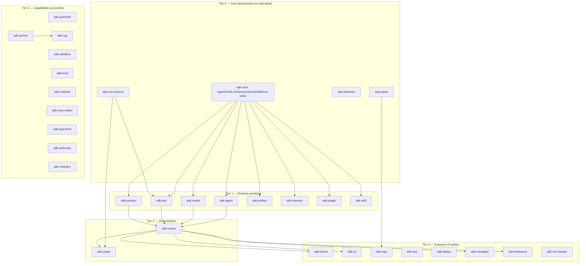

# adk-rust — Module Inventory (Pass A1)

39 workspace crates + 81 excluded example crates. `resolver = "2"`, `edition = "2024"`,
`rust-version = "1.94.0"`. LOC below = scc `Code` metric (comments/blanks excluded),
measured per-crate at the workspace tag; examples excluded. Whole-repo code total per
the reference manifest is 265,316 (includes examples); the 39 in-workspace crates sum
to ~242k code-lines.

## Workspace Scale Table (by LOC, descending)

| Crate | Code LOC | .rs files | Layer | Purpose (one line) |
|-------|---------:|----------:|-------|--------------------|
| adk-model | 27,913 | 100 | Integration | 10 LLM provider adapters (openai, anthropic, gemini, bedrock, azure_ai, deepseek, groq, ollama, openrouter, openai_compatible) + retry/usage/tool-call parsing |
| adk-server | 20,752 | 72 | Infra | HTTP/REST + A2A v1.0.0 JSON-RPC protocol, SSE streaming, task store, push notifications |
| adk-anthropic | 17,263 | 133 | Provider | First-party Anthropic Claude integration (standalone, distinct from adk-model/anthropic) |
| adk-payments | 14,485 | 74 | Capability | Agentic commerce: ACP + AP2 protocol baselines, payment kernel, journal, guardrails |
| adk-gemini | 14,141 | 96 | Provider | First-party Google Gemini integration (client, streaming, interactions API) |
| adk-tool | 10,846 | 57 | Runtime | Tool trait ecosystem: function tools, MCP client/manager, builtin tools, toolsets, code-exec |
| adk-graph | 10,709 | 55 | Capability | LangGraph-style graph orchestration: nodes, edges, reducers, checkpointing, HITL, streaming |
| adk-agent | 9,398 | 41 | Runtime | Agent implementations: LlmAgent + workflow agents (sequential/parallel/loop/conditional) + ambient |
| adk-session | 8,089 | 32 | Runtime | Session persistence: 8 backends + encryption wrapper + migration + rewind/time-travel |
| adk-audio | 8,029 | 78 | Capability | Audio processing utilities (formats, resampling, VAD support) |
| adk-mistralrs | 7,814 | 32 | Provider | Local LLM inference via mistralrs |
| adk-realtime | 7,737 | 56 | Capability | Real-time bidi voice/video agents (OpenAI Realtime, Gemini Live, LiveKit) |
| adk-core | 7,420 | 28 | Core | Foundational traits + types: Agent, Tool, Llm, Session, Event, AdkError, contexts |
| adk-runner | 6,208 | 25 | Runtime | Agent execution runtime: session orchestration, transfer loop, cache/compaction lifecycle |
| adk-managed | 6,160 | 23 | Infra | Managed agent runtime |
| adk-code | 5,754 | 25 | Capability | Code execution capabilities |
| adk-enterprise | 5,675 | 32 | Infra | Enterprise client SDK |
| adk-eval | 5,738 | 26 | Capability | Agent evaluation framework (trajectory + response-quality metrics, .test.json) |
| adk-auth | 4,838 | 36 | Infra | Authentication helpers + secret providers (AWS/Azure/GCP behind features) |
| adk-bench | 4,828 | 13 | Tooling | Benchmarking framework |
| adk-sandbox | 4,826 | 27 | Capability | Isolated code execution (process backend + wasmtime WASM backend) |
| adk-memory | 4,568 | 18 | Runtime | Semantic memory + search; project-scoped isolation |
| cargo-adk | 4,050 | 11 | Tooling | `cargo adk` subcommand |
| adk-browser | 3,863 | 18 | Capability | Browser automation integration |
| adk-cli | 2,128 | 11 | Tooling | CLI binary |
| adk-acp | 2,079 | 21 | Protocol | Agent Client Protocol (connect to Claude Code/Codex; expose ADK as ACP) |
| adk-awp | 2,071 | 17 | Protocol | Agentic Web Protocol impl (discovery, manifest, trust, consent, rate-limit, webhooks) |
| adk-plugin | 2,019 | 9 | Runtime | Plugin lifecycle-hook system (before/after run, message, event, model, tool) |
| adk-rag | 1,921 | 19 | Capability | RAG pipeline: embeddings, vector stores, chunking, reranking (feature-gated backends) |
| adk-action | 1,880 | 6 | Capability | Action nodes |
| adk-skill | 1,728 | 9 | Runtime | Skill registry (agentskills.io standard; .skill.md discovery, persona selection) |
| adk-deploy | 1,605 | 7 | Infra | Deployment helpers |
| awp-types | 1,171 | 12 | Protocol | Pure AWP wire types, zero adk-* deps |
| adk-artifact | 969 | 6 | Runtime | Artifact storage/retrieval |
| adk-telemetry | 888 | 7 | Infra | OpenTelemetry tracing/metrics facade + macros |
| adk-guardrail | 797 | 7 | Capability | Safety/content policy: content filter, PII redaction, schema validation |
| adk-rust-macros | 754 | 2 | Core | Procedural macros (#[tool], graph #[entrypoint]/#[task]) |
| adk-rust | 681 | 3 | Core | Re-export facade crate |
| adk-retry-reflect | 575 | 11 | Capability | Retry-with-reflection plugin: injects reflection prompts on tool failure |

## Layering Story ("core → runtime → integration")

adk-rust exhibits a disciplined 5-tier layering with `adk-core` as a pure-abstraction hub:



Observations grounding the layering claim (not conclusions):
- **`adk-core` has zero intra-workspace dependencies** and defines every load-bearing trait
  (`Agent`, `Tool`, `Llm`, `Session`, `State`, `Memory`, `Artifacts`, `SecretService`,
  `ToolContext`, `InvocationContext`, `SchemaAdapter`, `ToolRegistry`, `Toolset`,
  `CacheCapable`) plus the unified `AdkError`. This is the hub.
- **`adk-model` depends on `adk-core` and `adk-telemetry`** (via the `adk_telemetry::warn!`
  macro seen in retry.rs) but NOT on adk-agent/runner — providers are leaf integrations.
- **Provider duplication is deliberate**: `adk-model` contains an in-tree `anthropic/` and
  `gemini/` module family, while `adk-anthropic` (17k LOC) and `adk-gemini` (14k LOC) are
  *separate* first-party crates. Two provider surfaces for the same vendors coexist —
  a scope anomaly worth flagging (see patterns-observed WEAK-2).
- **`adk-runner` is the composition root**: it wires `Arc<dyn Agent>`, `Arc<dyn SessionService>`,
  `Option<Arc<dyn ArtifactService>>`, `Option<Arc<dyn Memory>>`, `Option<Arc<PluginManager>>`,
  `Option<Arc<dyn CacheCapable>>` behind feature flags (`artifacts`, `plugins`, `skills`,
  `context-compaction`). Arc-DI throughout.
- **Feature-flag gating is pervasive** — runner, model, agent, cli, mistralrs, managed all
  declare `default-features = false` in the workspace dependency table, indicating an
  intentional opt-in composition model rather than a monolith.

## Entry Points
- `adk-rust` (facade) — re-export surface for downstream consumers.
- `adk-cli` / `cargo-adk` — binaries.
- `adk-server::create_app` / `create_app_with_a2a` — HTTP entry.
- `adk_runner::Runner::builder()` — programmatic agent execution entry (typestate builder).

## Note-Only Inventory of the Rest (one paragraph each; deep passes follow)

**adk-graph** — LangGraph-analog. Directed-graph workflows with cyclic support, conditional
routing (dynamic `route` field on `EventActions`), typed state with reducers (overwrite/
append/sum/custom), per-step checkpointing, human-in-the-loop interrupts (before/after node
+ dynamic), and multiple stream modes (values/updates/messages/debug). A `functional` feature
adds `#[entrypoint]`/`#[task]` macros with automatic checkpointing and typed state reducers
(ReducedValue, UntrackedValue, MessagesValue). Directly maps to ferrochain-graph concern
(semport/graph). 14 integration-test files (3,185 LOC).

**adk-memory** — Semantic long-term memory with an in-memory service and a `MemoryService`
trait for custom backends. Distinctive feature: project-scoped isolation keyed by
`(app_name, user_id, project_id?)` with global vs project-scoped visibility rules and a
`MemoryServiceAdapter` bridging to `adk_core::Memory`. Maps to langchain-core §8
(Retrievers/VectorStores) concern.

**adk-server** — HTTP infrastructure built on axum, implementing the full A2A (Agent-to-Agent)
Protocol v1.0.0 with all 11 JSON-RPC operations behind an `a2a-v1` feature: RFC-3339
timestamps, message-ID idempotency, push-notification auth (Bearer + notification token),
INPUT_REQUIRED multi-turn resume, version negotiation via `A2A-Version` header, and SSE
streaming. Uses external `a2a-protocol-types` for wire types. 13 test files (4,906 LOC).

**adk-guardrail** — Input/output validation running in parallel with agent execution.
Ships `ContentFilter` (harmful/off-topic blocking), `PiiRedactor` (emails/phones/SSNs),
optional `SchemaValidator` (feature `schema`), a `GuardrailSet`/`GuardrailExecutor` composition
model, and a `Severity` enum. Notably has **zero integration-test files** (unit tests only) —
flagged for deep pass. Maps to ferrochain safety/NFR concern.

**adk-sandbox** — Isolated code execution behind a `SandboxBackend` trait with two impls:
`ProcessBackend` (default; `tokio::process::Command`, timeout + env isolation, but explicitly
NOT memory/network isolation) and `WasmBackend` (feature `wasm`; wasmtime in-process with
timeout + memory-limit + full no-fs/no-net sandboxing). Honest documentation of isolation
guarantee gaps. 7 test files (1,091 LOC).

**adk-eval** — Evaluation framework with structured `.test.json` test definitions, trajectory
evaluation (tool-call-sequence validation), and response-quality metrics (ground-truth,
rubric-based, LLM-judged). `tool_trajectory_score` and `response_similarity` criteria. Only
2 integration-test files (234 LOC) despite being an eval framework — flagged.

**adk-realtime** — Bidirectional real-time voice/video agents implementing the `adk_core::Agent`
trait via `RealtimeAgent` (parallel to LlmAgent). Multiple providers (OpenAI Realtime API,
Gemini Live API), audio streaming (PCM16, G711), server-side VAD, real-time tool calling.
LiveKit dependency with `native-tls` (contrast with workspace rustls default — noted for
dependency-disposition). 53 `.wav` test fixtures in the corpus likely live here or adk-audio.

**providers (adk-gemini / adk-anthropic / adk-mistralrs)** — First-party model integrations
as standalone crates, separate from adk-model's in-tree provider modules. adk-anthropic is
133 files / 17k LOC — the second-largest provider surface. adk-gemini implements both the
generateContent transport and the Interactions API (server-managed tool loop, `interaction_id`
chaining seen in adk-core::model). mistralrs is local inference.

**protocols (awp-types / adk-awp / adk-acp)** — Three protocol families. `awp-types` is a
dependency-free pure-wire-types crate (TrustLevel, RequesterType, A2aMessage, discovery/
manifest types) using camelCase serde. `adk-awp` is the full Agentic Web Protocol server
(TOML business context with hot-reload, JSON-LD capability manifests, trust-level assignment,
sliding-window rate limiting, consent capture/revocation, HMAC-SHA256 webhook signing,
health state machine). `adk-acp` integrates the external Agent Client Protocol standard
(agentclientprotocol.com) to connect ADK agents to Claude Code/Codex or expose ADK as ACP.
No LangChain analog; distinct from adk-server's A2A.

**adk-payments** — Protocol-neutral agentic commerce. Tracks ACP stable baseline `2026-01-30`,
ACP experimental channel, and AP2 `v0.1-alpha`. Modules: auth, domain, guardrail, journal,
kernel. 74 files / 14k LOC, 12 test files (3,669 LOC). No LangChain/LangGraph analog — a
scope anomaly for D16.

**adk-retry-reflect** — A plugin that intercepts tool-call failures and injects structured
reflection prompts (error details + original args + guidance) as modified tool results so the
agent self-corrects on the next turn, rather than propagating the error. Per-tool + global
retry limits, configurable backoff (none/fixed/exponential-with-ceiling), allowlist/denylist
eligibility, customizable templates, global failure tracking for circuit-breaking. Closest
LangGraph analog is retry edges. Potentially ferrochain-relevant reliability pattern.

## State Checkpoint
```yaml
pass: A1
scope: module-inventory
status: complete
crates_catalogued: 39
timestamp: 2026-07-13
```
