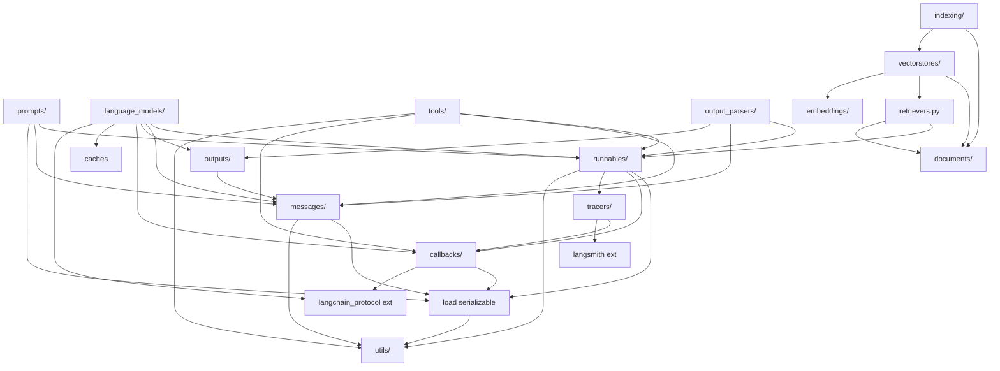

# langchain-core — Module Inventory

Package: `langchain_core`, version **1.4.9** (shipped in the `langchain==1.3.13` monorepo tag).
License MIT. `requires-python >=3.10,<4.0`. Build backend hatchling.

Measured with `tokei` + `find | wc -l` against
`/Users/jmagady/Dev/ferrochain/.reference/langchain/libs/core/langchain_core`.

## Scale Table

| Metric | Value |
|---|---|
| Python source files (`langchain_core/`) | **180** |
| Code lines (tokei) | **60,101** |
| Comment lines | 2,346 |
| Blank lines | 6,727 |
| Total physical lines | ~69,174 |
| Top-level sub-packages | 19 |
| Top-level single-file modules | 18 |
| Unit test files | 134 |
| Unit test functions | **1,766** |
| Unit test LOC | ~59,935 |
| Syrupy snapshot files (`.ambr`) | 5 (73 snapshots) |
| Third-party runtime deps | 9 |

**Rough parity read:** test LOC (~60k) ≈ source LOC (~60k). This is a test-heavy,
spec-rich package — favorable for test-as-spec extraction.

## Sub-package Inventory (by LOC, descending)

| Package | Files | LOC | Purpose / public API surface |
|---|---|---|---|
| `runnables/` | 16 | 14,284 | LCEL execution protocol. `Runnable` (ABC), `RunnableSerializable`, `RunnableSequence`, `RunnableParallel`/`RunnableMap`, `RunnableLambda`, `RunnableGenerator`, `RunnableBinding`, `RunnableEach`, `RunnableBranch`, `RunnableWithFallbacks`, `RunnableWithMessageHistory`, `RunnablePassthrough`/`Assign`/`Pick`, `RouterRunnable`, `RunnableConfig`, configurable fields, `Graph` + mermaid/ascii/png renderers. `base.py` alone is **6,713 LOC**. |
| `messages/` | 20 | 9,356 | Message hierarchy + v1 standard content blocks. `BaseMessage`(+Chunk), `AIMessage`(+Chunk), `HumanMessage`, `SystemMessage`, `ToolMessage`, `FunctionMessage`(legacy), `ChatMessage`, `RemoveMessage`. `content.py` (1,488) defines all `*ContentBlock` TypedDicts + `ContentBlock` union. `utils.py` (2,406): `trim_messages`, `filter_messages`, `merge_message_runs`, `convert_to_openai_messages`, `convert_to_messages`. `block_translators/` (8 provider modules <!-- [validation-corrected pass-6]: main table said "7 files"; pass-7 deepening §C-3 confirmed 8 provider modules: anthropic/bedrock/bedrock_converse/google_genai/google_vertexai/groq/langchain_v0/openai plus __init__.py -->) maps provider formats ↔ standard blocks. |
| `language_models/` | 10 | 8,209 | Model interfaces. `BaseLanguageModel` (base.py), `BaseChatModel` + `SimpleChatModel` (chat_models.py 2,711), `BaseLLM`/`LLM` (llms.py 1,569), fakes, `chat_model_stream.py` (1,441 — v3 protocol streaming), `_compat_bridge.py` (844 — v0/v1 output-version bridging), `model_profile.py`. |
| `tracers/` | 15 | 5,209 | Callback-based run tracing. `BaseTracer`, `event_stream.py` (1,105 — `astream_events` v2), `log_stream.py` (769 — `astream_log`, jsonpatch), `LangChainTracer` (langsmith), console/stdout tracers, root listeners, `RunLog`/`RunLogPatch`. |
| `callbacks/` | 7 | 4,850 | Lifecycle event system. `BaseCallbackHandler` + async variant (base.py 1,229), `CallbackManager`/`AsyncCallbackManager` + `*ForRun` scoped managers (manager.py 2,826), file/stdout/streaming handlers, `UsageMetadataCallbackHandler`. |
| `prompts/` | 12 | 4,495 | Prompt templates (all Runnables). `BasePromptTemplate`, `PromptTemplate`, `ChatPromptTemplate` (chat.py 1,495), `MessagesPlaceholder`, `FewShotPromptTemplate`(+chat/with-templates), `PipelinePromptTemplate`, `StructuredPrompt`, image/dict prompts, loaders. |
| `utils/` | 19 | 4,690 | Cross-cutting helpers. `function_calling.py` (847 — pydantic→JSON-schema tool conversion, `convert_to_openai_tool`), `mustache.py` (706 — vendored mustache engine), `pydantic.py` (630 — `create_model_v2`, v1/v2 compat), `json.py` (`parse_partial_json`), `json_schema.py` (`dereference_refs`), `_merge.py` (dict/list merge for chunks), `aiter.py`/`iter.py` (tee/merge), `html`, `strings`, `formatting` (f-string), `usage`, `uuid`, `image`. |
| `tools/` | 7 | 2,925 | Tool abstraction. `BaseTool` (base.py 1,711, a Runnable), `StructuredTool`, `Tool` (simple), `@tool` decorator + `convert_runnable_to_tool` (convert.py), `InjectedToolArg`/`InjectedToolCallId`, `ToolException`, `BaseToolkit`, render helpers. |
| `load/` | 6 | 2,656 | LangChain serialization. `Serializable` base + `dumps`/`dumpd`/`loads`/`load` (Reviver), `mapping.py` (1,085 — namespace→class SERIALIZABLE_MAPPING), secret handling, validation. |
| `output_parsers/` | 11 | 2,253 | `BaseOutputParser`/`BaseGenerationOutputParser`/`BaseTransformOutputParser`/`BaseCumulativeTransformOutputParser`, `StrOutputParser`, `JsonOutputParser`, `PydanticOutputParser`, `XMLOutputParser`, list parsers, `JsonOutputToolsParser`/`PydanticToolsParser` (openai_tools), openai_functions parsers. |
| `indexing/` | 4 | 1,772 | Document indexing API. `index()`/`aindex()`, `RecordManager`/`InMemoryRecordManager`, `DocumentIndex`, dedup/hashing. |
| `vectorstores/` | 4 | 1,873 | `VectorStore` ABC (base.py — similarity search, MMR, `as_retriever`, `from_texts`), `VectorStoreRetriever`, `InMemoryVectorStore` (numpy). |
| `_api/` | 5 | 1,063 | Internal API-lifecycle: `@deprecated`, `@beta`, warnings, path helpers. |
| `_security/` | 5 | 767 | SSRF protection: URL policy transport, blocklists (tested heavily). |
| `example_selectors/` | 4 | 604 | `BaseExampleSelector`, length-based + semantic-similarity selectors. |
| `documents/` | 4 | 555 | `Document` (page_content/metadata, a Serializable), `BaseDocumentTransformer`, `BaseDocumentCompressor`. |
| `outputs/` | 6 | 476 | `Generation`, `ChatGeneration`(+Chunk), `LLMResult`, `ChatResult`, `RunInfo`. |
| `document_loaders/` | 4 | 415 | `BaseLoader`, `BaseBlobParser`, `Blob`, langsmith loader. |
| `embeddings/` | 3 | 238 | `Embeddings` ABC (`embed_documents`/`embed_query` + async), `FakeEmbeddings`, `DeterministicFakeEmbedding`. |

## Top-level single-file modules

| Module | LOC | Purpose |
|---|---|---|
| `retrievers.py` | 328 | `BaseRetriever` (Runnable ABC), `_get_relevant_documents` contract, LangSmith params. |
| `stores.py` | 291 | `BaseStore` (KV), `InMemoryStore`, `InMemoryByteStore`, `ByteStore`. |
| `caches.py` | 272 | `BaseCache` (LLM response cache), `InMemoryCache`. |
| `rate_limiters.py` | 256 | `BaseRateLimiter`, `InMemoryRateLimiter` (token-bucket, sync+async acquire). |
| `agents.py` | 258 | `AgentAction`(+MessageLog), `AgentFinish`, `AgentStep` (legacy AgentExecutor scaffolding). |
| `chat_history.py` | 246 | `BaseChatMessageHistory`, `InMemoryChatMessageHistory`. |
| `structured_query.py` | 203 | Self-query IR: `Comparison`, `Operation`, `StructuredQuery`, `Visitor`. |
| `prompt_values.py` | 161 | `PromptValue`, `StringPromptValue`, `ChatPromptValue`, `ImagePromptValue`. |
| `sys_info.py` | 137 | Environment reporting. |
| `exceptions.py` | 111 | `LangChainException`, `OutputParserException`, `TracerException`, `ErrorCode`. |
| `globals.py` | 72 | Global `verbose`/`debug`/`llm_cache` flags. |
| `_import_utils.py` | 41 | Lazy `__getattr__` import machinery used by every `__init__.py`. |
| `chat_loaders.py`, `chat_sessions.py`, `cross_encoders.py`, `env.py`, `version.py`, `__init__.py` | <30 each | Small interfaces / stubs. |

## Internal Dependency Graph (import edges, coarse)

**Layering observations for the Rust port:**

1. **`utils/` + `load/serializable` are the true base layer** — imported everywhere,
   no upward deps. Port these first (much of `utils` is ELIMINATE-able in Rust).
2. **`runnables/base` is the load-bearing keystone** — imports callbacks, tracers,
   config, load, and is imported by prompts, language_models, tools, output_parsers,
   retrievers. A 6,713-line single file; expect it to fan out into ~10 Rust modules.
3. **`messages/` is nearly independent** (only load + utils) — a clean, early port
   target and the highest-value serde surface.
4. **`callbacks` ↔ `tracers` are tightly coupled**; tracers are callback handlers.
   `astream_events`/`astream_log` live in tracers but are surfaced as Runnable methods.
5. **External seams:** `langsmith` (tracing SaaS client) and the **new
   `langchain_protocol`** package (wire protocol for v3 content-block streaming) are
   the only hard external couplings inside core logic (besides pydantic).

## Circular-import mitigation pattern (pervasive, port-relevant)

Every `__init__.py` uses a lazy `__getattr__` + `_dynamic_imports` dict (see
`_import_utils.import_attr`) to defer submodule imports, and dozens of functions do
function-local imports (e.g. `BaseMessage.content_blocks` imports each block
translator inside the method body). This exists to break Python import cycles and to
keep import latency low (langsmith import is ~132ms, deferred). **In Rust this entire
mechanism is ELIMINATE** — the module graph is resolved at compile time; cycles are
handled by the crate/module system, and there is no import-time cost to amortize.

---

# Pass 7 deepening (2026-07-12) — inventory corrections

## `messages/block_translators/` — 8 provider modules (not 7) + `__init__`

The `messages/` row said "block_translators/ (7 files)". Actual source: **8 provider modules +
`__init__.py`**: `anthropic.py`, `bedrock.py`, `bedrock_converse.py`, `google_genai.py`,
**`google_vertexai.py`** (missed by Pass 1), `groq.py`, `langchain_v0.py`, `openai.py`. The
`__init__.py` holds the **`PROVIDER_TRANSLATORS` registry** + `register_translator()` (a
public extension seam integration packages call) + `_register_translators()`. There is no
`registration.py` module (Pass 1 test-inventory listed one — it does not exist; registration
is in `__init__.py`). Architecture is registry + fixed fallback pipeline — see behavioral-intent
Pass 7 §D-3.

## `runnables/base.py` (6,713 LOC) — verified concrete-type fanout

Full read confirms the file defines: `Runnable` (ABC, 1 abstractmethod `invoke` + ~60 concrete/
overloaded methods), `RunnableSerializable`, `RunnableSequence`, `RunnableParallel`,
`RunnableGenerator`, `RunnableLambda`, `RunnableEachBase`/`RunnableEach`,
`RunnableBindingBase`/`RunnableBinding`, plus the `_RunnableCallable*` Protocols, the
`RunnableLike` union, `coerce_to_runnable`, and the `@chain` decorator. `RunnableRetry`,
`RunnableWithFallbacks`, `RunnableConfigurableFields/Alternatives`, `RunnableBranch`,
`RunnablePassthrough/Assign/Pick`, `RouterRunnable`, `RunnableWithMessageHistory` live in
sibling files (`retry.py`, `fallbacks.py`, `configurable.py`, `branch.py`, `passthrough.py`,
`router.py`, `history.py`) and are pulled in via local imports to break cycles. Rust fanout
estimate (~10 modules) holds; note `RunnableBinding.__getattr__` transparent method delegation
(base.py:6537) has no Rust analog and must be redesigned, not translated.

## `langchain_protocol` external dep — recharacterized

Module-inventory §External seams called it "the new `langchain_protocol` package (wire protocol
for v3 content-block streaming)". It is actually the **full LangChain Agent Streaming Protocol**
(JSON-RPC commands + 9-channel events + state/checkpoint/fork + reconnection), of which core
uses only the `MessagesData` content-block subset at 6 import sites. Not vendored in the clone
(pin `>=0.0.17`; only v0.0.15 present in an external docker site-packages). Full detail:
dependency-disposition Pass 7 deepening.
