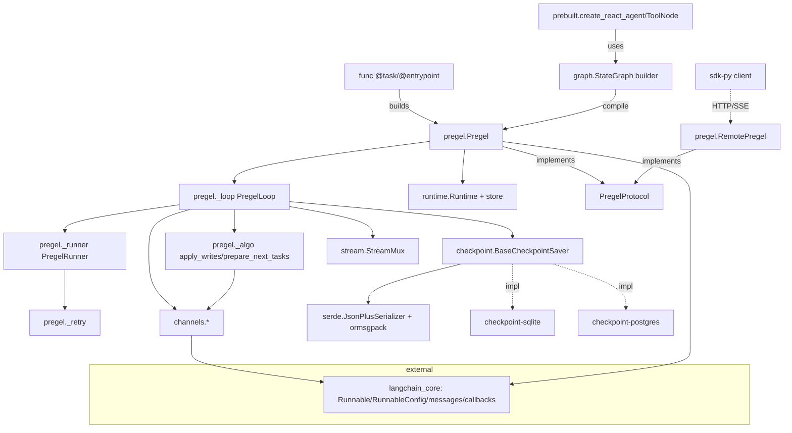

# LangGraph → Rust (ferrochain-graph) Module Inventory

## 0. Scale summary

| Package (src only, excl. tests) | Py files | LOC | Depth pass | Port priority |
|---|---|---|---|---|
| `libs/langgraph/langgraph` (core runtime) | 78 | **27,846** | DEEP | P0 |
| `libs/checkpoint/langgraph` (base saver + serde + store + cache) | 17 | **5,892** | DEEP | P0 | <!-- [validation-corrected: 17 not 18; wc -l verified] -->
| `libs/checkpoint-postgres/langgraph` | 9 | **4,891** | DEEP (schema) | P1 |
| `libs/checkpoint-sqlite/langgraph` | 8 | **3,849** | DEEP (schema) | P1 |
| `libs/prebuilt/langgraph` (react agent, ToolNode) | 7 | **3,676** | DEEP | P1 |
| `libs/sdk-py/langgraph_sdk` (Platform client) | 45 | **18,728** | INVENTORY only | P2 | <!-- [validation-certification-1]: REVERTED exhaustive M-05 correction; find .reference/langgraph/libs/sdk-py/langgraph_sdk -name "*.py" | wc -l = 45, xargs wc -l = 18,728. M-05 used the broader libs/sdk-py path (63 files/20,787 LOC incl. setup.py, examples, scripts) rather than the labeled langgraph_sdk package directory. All other rows in this table count the package sub-directory; this row must match that scope. Total libs/sdk-py non-test files = 63/20,787 for reference only. -->
| `libs/cli/langgraph_cli` (deploy/build/dev) | 19 | **8,383** | INVENTORY only | P3 (mostly OUT) | <!-- [validation-certification-1]: REVERTED exhaustive M-06 correction; find .reference/langgraph/libs/cli/langgraph_cli -name "*.py" | wc -l = 19, xargs wc -l = 8,383. M-06 used the broader libs/cli path (46 files/9,997 LOC) instead of the labeled langgraph_cli package directory. Total libs/cli non-test files = 46/9,997 for reference only. -->
| **In-scope source subtotal (deep)** | — | **~46,154** | — | — |
| Core test suite (`libs/langgraph/tests`) | 49 test files | **63,249** | spec input | — |

Headline: the deep-scope runtime + persistence surface is ~46k LOC of source with a
**63k-LOC core test suite** — the tests are 1.36x the size of all deep source combined
and are the authoritative behavioral spec (see test-inventory.md). This is a
substantially larger and more semantically dense port than langchain-core (pass 1).

## 1. Core runtime module map (`libs/langgraph/langgraph`)

### 1.1 `pregel/` — the execution engine (the crux, **14,873 LOC** total, 24 files) <!-- [validation-exhaustive]: previous "~11.5k LOC" was inaccurate; wc -l of all 24 .py files in pregel/ = 14,873. Two additional unlisted files found: _executor.py (223 LOC, Submit protocol + async/sync execution context) and _log.py (3 LOC, stub). Also: pregel/_config.py is 0 LOC (an empty placeholder); the 474 LOC config logic lives at _internal/_config.py (ensure_config/DEFAULT_RECURSION_LIMIT). pregel/types.py is 38 LOC (a thin re-export stub); the 984 LOC canonical types live at langgraph/types.py (package root). These attribution errors partially explain the undercount. -->
| File | LOC | Purpose |
|---|---|---|
| `main.py` | 4,364 | `Pregel` class: the compiled graph. `invoke/ainvoke/stream/astream/stream_events`, `get_state/get_state_history`, `update_state/bulk_update_state`, `with_config`, `get_graph`. The public runtime surface. |
| `_loop.py` | 1,988 | `PregelLoop` / `SyncPregelLoop` / `AsyncPregelLoop`: the super-step driver. `tick()` (prepare tasks), `after_tick()` (apply writes + checkpoint), `put_writes`, `_put_checkpoint`, `accept_push`, `match_cached_writes`, durability gating, drain/interrupt handling. |
| `_algo.py` | 1,460 | Pure super-step algorithm: `apply_writes`, `prepare_next_tasks`, `prepare_single_task` (PUSH/PULL), `should_interrupt`, `_triggers`, task-id hashing (`_xxhash_str`/`_uuid5_str`), scratchpad construction, resume-value matching. |
| `_runner.py` | 941 | `PregelRunner`: schedules the tasks of one super-step as concurrent futures (`concurrent.futures` / asyncio), `FIRST_COMPLETED` wait loop, panic/stop propagation, retry integration, waiter for streaming. |
| `_retry.py` | 854 | Per-task retry loop honoring `RetryPolicy`; timeout enforcement (`TimeoutPolicy` idle/run), `NodeCancelledError`/`NodeTimeoutError` conversion. |
| `remote.py` (1,308) + `_remote_run_stream.py` (374) | 1,682 | `RemotePregel`: a `PregelProtocol` impl that proxies to a Platform server over the SDK. Bridges local graph API to remote execution. |
| `_read.py` (298) / `_write.py` (192) | 490 | `PregelNode` (the compiled node: channels/triggers/writers/mapper), `ChannelWrite`/`PregelWrite` write-spec objects. |
| `_checkpoint.py` | 331 | `channels_from_checkpoint`, `create_checkpoint` glue, delta-snapshot selection. |
| `_call.py` (298) / `_tools.py` (268) | 566 | `get_runnable_for_task`, functional-API `Call`, tool-call plumbing. |
| `_executor.py` | 223 | **[validation-exhaustive: previously unlisted]** `Submit` protocol (sync/async execution context), `copy_context` isolation, `run_coroutine_threadsafe` bridging. The execution context abstraction used by `_runner.py`. |
| `debug.py` (302), `_messages.py` (461), `_io.py` (174), `_draw.py` (294), `_utils.py` (291), `_validate.py` (120), `protocol.py` (288), `types.py` (38 re-export stub; canonical types at `langgraph/types.py` 984 LOC) | ~1.97k | debug/checkpoint/task event mapping (`map_debug_*`), message-stream tap, input/output mapping, mermaid/graphviz drawing, graph validation, `PregelProtocol` ABC. NOTE: `pregel/_config.py` is 0 LOC (empty placeholder); config logic is in `_internal/_config.py` (474 LOC, `ensure_config`/`DEFAULT_RECURSION_LIMIT`). |

### 1.2 `channels/` — Pregel channel types (the reducer algebra, ~1.2k LOC)
| Channel | Semantics |
|---|---|
| `LastValue` | ≤1 update/step; else `InvalidUpdateError`. Default for scalar state keys. |
| `LastValueAfterFinish` | Like LastValue but value only readable after `finish()`; cleared on `consume()`. |
| `BinaryOperatorAggregate` | Fold updates with a binary op (e.g. `operator.add`). Supports `Overwrite` to bypass reducer (≤1 per step). The reducer-backed `Annotated[...]` state keys. |
| `Topic` | PubSub list; `accumulate=True/False` (clear-per-step vs persist). Flattens list updates. Backs the `TASKS`/Send channel and multi-value fan-in. |
| `EphemeralValue` | Holds a value for exactly one step (guard=True → ≤1 update). Not persisted across steps. |
| `AnyValue` | Stores last value, assumes all updates equal; available while a value is held, but cleared back to MISSING when `update([])` is called (as happens during `bump_step` for channels not written that step). <!-- [validation-corrected pass-8]: "never empty once written" was inaccurate; `update([])` with a non-MISSING value resets `self.value = MISSING` (any_value.py:53-58); pregel/_algo.py:326-333 calls `update(EMPTY_SEQ)` on every available-but-not-updated channel each step when bump_step=True, so AnyValue channels that are not re-written each step become empty. No tests cover this behavior (AnyValue has zero tests in the reference corpus). --> |
| `NamedBarrierValue` / `NamedBarrierValueAfterFinish` | Barrier: becomes available only when all named upstream nodes have written. Backs join/synchronization. |
| `UntrackedValue` | Value NOT persisted to checkpoint (sanitized out of writes/Sends). Runtime-only scratch. |
| `DeltaChannel` (beta) | Stores deltas; periodic `_DeltaSnapshot` blobs; history reconstructed by walking parent chain. Heavy checkpoint-saver contract (copy/prune/delete must preserve ancestor chain). |
| `BaseChannel` (ABC) | `get/update/checkpoint/from_checkpoint/consume/finish/is_available` + `ValueType`/`UpdateType`. |

### 1.3 `graph/` — StateGraph builder API (~2.8k LOC)
| File | LOC | Purpose |
|---|---|---|
| `state.py` | 1,964 | `StateGraph`: `add_node` (5 overloads), `add_edge`, `add_conditional_edges`, `add_sequence`, `set_entry_point`/`set_finish_point`/`set_conditional_entry_point`, `compile()` → `CompiledStateGraph(Pregel)`. State-schema → channel derivation (reducers from `Annotated`), input/output schema handling. |
| `message.py` | 437 | `add_messages` reducer (the canonical message-list merge), `MessagesState`. |
| `_branch.py` (225), `_node.py` (95), `ui.py` (227) | ~547 | Conditional-edge `Branch` resolution, `StateNodeSpec`, UI/`push_ui_message` for generative-UI streaming. |

### 1.4 supporting subsystems
| Subsystem | Files | Notes |
|---|---|---|
| `stream/` | **7 files**, 2,973 LOC <!-- [validation-exhaustive]: 8 was inaccurate; wc -l + ls confirm 7 files: __init__.py(45), _convert.py(32), _mux.py(523), _types.py(330), run_stream.py(663), stream_channel.py(341), transformers.py(1039). LOC total 2,973 matches prior ~2.9k claim. --> | `StreamMux` multiplexer, `StreamChannel`, `StreamTransformer` (v3 projection extension point), converters, run_stream. Backs the 7 stream modes + v3 `stream_events`. |
| `func/` | `__init__.py` 620 LOC | Functional API: `@task` / `@entrypoint` decorators building a Pregel graph implicitly. |
| `managed/` | `is_last_step`, `base` | `ManagedValue` (runtime-injected pseudo-channels like `RemainingSteps`). |
| `_internal/` | **15 files**, 2,893 LOC <!-- [validation-exhaustive]: 16 files/~3.2k LOC was inaccurate; ls + wc -l confirm 15 files (2,893 LOC): __init__, _cache, _config(474), _constants, _fields, _future, _pydantic, _queue, _replay, _retry, _runnable(942), _scratchpad, _serde, _timeout, _typing. No 16th file present. --> | `_scratchpad` (interrupt/resume/call counters), `_retry`, `_runnable` (RunnableCallable/RunnableSeq — a private LCEL subset), `_serde`, `_config` (474 LOC: `ensure_config`, `DEFAULT_RECURSION_LIMIT=10007`), `_queue`, `_future`, `_replay`, `_pydantic`, `_fields`, `_typing`, `_constants` (all the `CONFIG_KEY_*`, `PUSH`/`PULL`, channel sentinels), `_cache`, `_timeout`. |
| `runtime.py` | 310 | `Runtime` (per-task injected context: `store`, `previous`, `stream_writer`, `ExecutionInfo`, `context`), `get_runtime`. |
| `types.py` | 984 | Public types: `Command`, `Send`, `Interrupt`, `interrupt()`, `Overwrite`, `RetryPolicy`, `TimeoutPolicy`, `CachePolicy`, `StreamMode`, all `*StreamPart` TypedDicts, `StateSnapshot`, `PregelTask`, `Durability`. |
| `pregel/protocol.py` | 288 | `PregelProtocol` ABC — the interface both local `Pregel` and `RemotePregel` implement (enables remote/subgraph substitution). |

## 2. Checkpoint library map (`libs/checkpoint/langgraph`)

| Module | Purpose |
|---|---|
| `checkpoint/base/__init__.py` (860 LOC) <!-- [validation-exhaustive]: 861 was off by 1; wc -l = 860 --> | `BaseCheckpointSaver[V]` interface (get/list/put/put_writes + async twins + delete_thread/copy_thread/prune/delete_for_runs + delta history), `Checkpoint` TypedDict (v/id/ts/channel_values/channel_versions/versions_seen/updated_channels), `CheckpointMetadata`, `CheckpointTuple`, `WRITES_IDX_MAP`, `EXCLUDED_METADATA_KEYS`, `create_checkpoint`/`empty_checkpoint`. |
| `checkpoint/base/id.py` | `uuid6` monotonic checkpoint IDs (sortable, clock_seq=step). |
| `checkpoint/memory/__init__.py` | `InMemorySaver` reference implementation (the conformance baseline). |
| `checkpoint/serde/jsonplus.py` | `JsonPlusSerializer`: ormsgpack primary, jsonplus (lc-JSON) fallback; typed-object encode/decode for Pydantic v2 models, Pydantic v1 models, Enum, dataclasses, namedtuples, datetime/uuid/decimal/set/deque/ipaddress/pathlib/msgs/langgraph types, and numpy arrays (conditional); `LANGGRAPH_STRICT_MSGPACK` allowlist gate. <!-- [validation-corrected pass-4]: previous summary omitted Pydantic (v1+v2), Enum, and dataclass dispatch paths from `_msgpack_default`; see behavioral-intent §2.3 for full dispatch order --> |
| `checkpoint/serde/types.py` (68 LOC) | **[validation-corrected: previously omitted]** Critical sentinel constants: `TASKS = "__pregel_tasks"` (the Send/PUSH task queue channel), `INTERRUPT = "__interrupt__"`, `RESUME = "__resume__"`, `ERROR = "__error__"`, `SCHEDULED = "__scheduled__"`. Also `_DeltaSnapshot` NamedTuple (snapshot blob for DeltaChannel). `TASKS` is imported by `pregel/_algo.py` and is the canonical name for the Tasks Topic channel. |
| `serde/_msgpack.py` | `SAFE_MSGPACK_TYPES` allowlist; ext-hook encode/decode; strict-mode security control. |
| `serde/base.py` | `SerializerProtocol` (`dumps`/`loads`/`dumps_typed`/`loads_typed`), `maybe_add_typed_methods`. |
| `serde/encrypted.py` | `EncryptedSerializer` wrapping an inner serde with a cipher. |
| `serde/event_hooks.py` | `emit_serde_event` observability hook. |
| `store/base/*` | `BaseStore` (long-term memory KV+vector), `Item`, batched ops, `embed`. `store/base/embed.py` provides the embedding helper. |
| `cache/{base,memory,redis}` | `BaseCache` (node-level result cache keyed by `CacheKey`). `cache/redis/__init__.py` (144 LOC) provides `RedisCache` — a Redis-backed distributed cache with TTL support; requires an injected `redis` client (test dep only, NOT a declared runtime dep of langgraph-checkpoint). **[validation-corrected: redis cache module previously unmentioned]** |

## 3. Backend saver schemas (persistence contract)

### SQLite (`SqliteSaver` / `AsyncSqliteSaver`) — single-blob model
- `checkpoints(thread_id, checkpoint_ns, checkpoint_id, parent_checkpoint_id, type, checkpoint BLOB, metadata BLOB, PK(thread_id,ns,id))` — full checkpoint serialized as ONE msgpack blob.
- `writes(thread_id, checkpoint_ns, checkpoint_id, task_id, idx, channel, type, value BLOB, PK(thread_id,ns,id,task_id,idx))` — pending writes.
- `PRAGMA journal_mode=WAL`; a `threading.Lock` for the sync saver. Also `cache` and `store`/`store_vectors` tables in sibling modules; `_delta.py` handles DeltaChannel history walk in SQL.

### Postgres (`PostgresSaver` / `AsyncPostgresSaver` / `ShallowPostgresSaver`) — normalized/content-addressed model
- `checkpoint_migrations(v)` — versioned migration ledger (10 migrations).
- `checkpoints(thread_id, checkpoint_ns, checkpoint_id, parent_checkpoint_id, type, checkpoint JSONB, metadata JSONB, PK(...))` — checkpoint metadata WITHOUT inline channel values (channel_versions live inside the JSONB).
- `checkpoint_blobs(thread_id, checkpoint_ns, channel, version, type, blob BYTEA, PK(thread_id,ns,channel,version))` — **channel values de-duplicated by (channel,version)**: unchanged channels are shared across checkpoints. This is the key structural difference from SQLite.
- `checkpoint_writes(thread_id, checkpoint_ns, checkpoint_id, task_id, idx, channel, type, blob BYTEA, task_path, PK(...))`.
- Read reassembles channel_values by joining `jsonb_each_text(checkpoint->'channel_versions')` against `checkpoint_blobs`. Pending Sends read from writes where channel=`TASKS`.
- `ShallowPostgresSaver` keeps only the latest checkpoint per thread (no history/time-travel) — a distinct durability tier.
- Separate `store`/`store_vectors` tables (pgvector) for long-term memory.

**Port implication:** the Rust port must decide whether to mirror BOTH storage shapes
(single-blob vs normalized-blob) or unify. The normalized model is required for the
Postgres blob-dedup optimization and for DeltaChannel; SQLite's single-blob is simpler.
The `BaseCheckpointSaver` trait must be storage-shape-agnostic (see dependency-disposition).

## 4. Prebuilt map (`libs/prebuilt/langgraph`)

| File | LOC-ish | Purpose |
|---|---|---|
| `chat_agent_executor.py` | ~1,015 | `create_react_agent` — the ReAct tool-calling agent graph (model↔tools loop) built on StateGraph. `AgentState`/`AgentStatePydantic` (deprecated → moved to `langchain.agents`), structured-response support. NOTE: much moved to `langchain` v1 pkg; this is now largely a compat/re-export shim. |
| `tool_node.py` | 2,030 <!-- [validation-corrected pass-4]: ~1,830 was stale; pass-1 identified correct value 2,030 (wc -l confirmed) but wrote "documentation updated implicitly" without editing the file; actual LOC = 2,030 --> | `ToolNode` (executes tool calls from the last AIMessage, returns ToolMessages), `tools_condition` (route to tools vs END), `InjectedState`/`InjectedStore` injection, `ValidationNode`. |
| `interrupt.py` | ~110 | `HumanInterrupt`/`HumanInterruptConfig`/`ActionRequest`/`HumanResponse` — the standard HITL interrupt payload schema for review/edit/accept/respond. |
| `tool_validator.py`, `_tool_call_stream.py`, `_tool_call_transformer.py` | — | tool-call streaming projection + validation. |

## 5. SDK / CLI (INVENTORY ONLY — deep pass deferred)

### `sdk-py/langgraph_sdk` (~18.7k LOC) — Platform HTTP client
- `LangGraphClient` composed of resource clients: `AssistantsClient`, `ThreadsClient`,
  `RunsClient`, `CronClient`, `StoreClient`. Both `_async/` and `_sync/` mirrors (codegen'd).
- `schema.py` (~53 types): `Assistant`, `Thread`, `Run`, `Cron`, `StreamPart`, `Checkpoint`, `Command`, `Config`, `StreamMode`, etc.
- `stream/` subsystem: SSE/WebSocket transports, `controller`, `multi_cursor_buffer`, `decoders`, `subscription` — client-side reconnecting stream consumption.
- `auth/` (custom auth handler types + exceptions), `encryption/`, `sse.py`, `runtime.py`.
- **Port note:** this is a REST/SSE/WS client for the proprietary LangGraph Platform. In
  port scope per D7 but deferred; the wire protocol (assistants/threads/runs/store,
  stream envelope) is what matters, not the Python object model.

### `cli/langgraph_cli` (~8.4k LOC) — deploy/dev tooling
- Click CLI: `up` (launch API server via Docker), `build` (build image), `dockerfile`,
  `dev` (in-process dev server), `new` (scaffold from template), config validation.
- Heavy Docker/compose/uv-lock/dependency-tracking logic. **Mostly OUT of a faithful
  runtime port** — it orchestrates the proprietary platform server. Only `langgraph.json`
  config schema (`config.py`/`schemas.py`) is conceptually relevant.

## 6. Dependency graph (module level)



Hard external coupling: **`langchain-core`** (`Runnable`, `RunnableConfig`, `messages`,
`callbacks`) is pervasive — every node is wrapped as a `Runnable`, config threads through
everything, and `add_messages`/message-stream lean on `langchain_core.messages`. The
ferrochain-core (pass 1) crate is a hard prerequisite. `ormsgpack` + `xxhash` +
`langchain_core.load.Reviver` are the other load-bearing third-party deps.

## Entry points
- `StateGraph(state_schema).compile(checkpointer=...)` → `CompiledStateGraph` (a `Pregel`). Primary.
- `@entrypoint`/`@task` (functional API) → `Pregel`. Secondary.
- `create_react_agent(model, tools, ...)` (prebuilt) → `CompiledStateGraph`. Convenience.
- `Pregel.invoke/stream/astream/...` — the execution surface.
- `RemotePregel` — remote proxy (Platform).

## State checkpoint
```yaml
pass: 2
artifact: module-inventory
status: complete
files_scanned: 40+ (all deep-scope key files read; sdk/cli inventoried by grep)
deep_scope_loc: 46154
validation_note: "checkpoint file count corrected 18→17; sqlite-vec dep added; serde/types.py and RedisCache documented [validation-corrected]; [validation-exhaustive]: pregel/ LOC corrected ~11.5k→14,873 (24 files); _executor.py added; pregel/_config.py is 0 LOC (empty), pregel/types.py is 38 LOC stub (not 984); canonical 984 LOC types at langgraph/types.py; stream/ 8→7 files; _internal/ 16→15 files, ~3.2k→2,893 LOC; checkpoint/base/__init__.py 861→860 LOC; [validation-certification-1]: sdk-py and cli reverted to package-directory scope (langgraph_sdk=45/18728, langgraph_cli=19/8383); exhaustive M-05/M-06 had used broader libs/sdk-py and libs/cli paths inconsistent with labeled directory scope"
core_test_loc: 63249
timestamp: 2026-07-12
```
