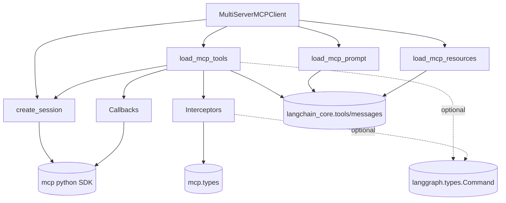

# langchain-mcp-adapters — Module Inventory

## Module manifest

| Module | LOC | Public surface | Key deps | Port class | Priority |
|---|---|---|---|---|---|
| `tools.py` | 685 | `convert_mcp_tool_to_langchain_tool`, `load_mcp_tools`, `to_fastmcp`, `MCPToolArtifact` | mcp, langchain_core.tools, pydantic, langgraph(opt) | PORT (over rmcp) | P0 |
| `sessions.py` | 477 | `Connection` union, `StdioConnection`/`SSEConnection`/`StreamableHttpConnection`/`WebsocketConnection`, `create_session`, `McpHttpClientFactory` | mcp.client.*, httpx | PORT (over rmcp transports) | P0 |
| `client.py` | 302 | `MultiServerMCPClient` | asyncio, mcp | PORT | P0 |
| `interceptors.py` | 141 | `ToolCallInterceptor`, `MCPToolCallRequest`, `MCPToolCallResult` | mcp.types, langgraph(opt) | PORT | P1 |
| `callbacks.py` | 141 | `Callbacks`, `CallbackContext`, `_MCPCallbacks`, `*Callback` protocols | mcp callback types | PORT | P1 |
| `resources.py` | 103 | `load_mcp_resources`, `get_mcp_resource`, `convert_mcp_resource_to_langchain_blob` | mcp.types, langchain_core Blob | PORT | P1 |
| `prompts.py` | 59 | `load_mcp_prompt`, `convert_mcp_prompt_message_to_langchain_message` | mcp.types, langchain_core messages | PORT | P1 |
| `__init__.py` | 6 | package docstring only (no `__version__` variable) [validation-exhaustive] | — | — | P3 |

## Component / dependency graph



The `mcp` Python SDK is the **load-bearing external dependency** (transports,
`ClientSession`, all wire types). In pregolya this node becomes **`rmcp`**.

## Key symbol catalog

| Symbol | File:lines | Role |
|---|---|---|
| `convert_mcp_tool_to_langchain_tool` | tools.py:357-536 | MCP Tool → StructuredTool; builds `call_tool` coroutine + interceptor chain + error handler |
| `_convert_mcp_content_to_lc_block` | tools.py:175-223 | 6-way content-block translation (incl. audio→NotImplemented) |
| `_convert_call_tool_result` | tools.py:226-283 | CallToolResult → (content, artifact); raises `_MCPToolExecutionError` on isError |
| `_MCPToolExecutionError` | tools.py:99-119 | ToolException carrying converted blocks (message snapshot at construction) |
| `_handle_mcp_tool_error` | tools.py:122-158 | handle_tool_error callback; returns blocks or re-raises |
| `_build_interceptor_chain` | tools.py:286-317 | Onion composition (note default-arg closure capture to avoid late-binding) |
| `_list_all_tools` | tools.py:320-354 | Cursor pagination, MAX_ITERATIONS=1000 |
| `load_mcp_tools` | tools.py:539-610 | List + convert all tools |
| `to_fastmcp` | tools.py:638-685 | LC tool → FastMCP server tool (server-side) [validation-exhaustive: file is 685 lines; 686 does not exist] |
| `create_session` | sessions.py:405-477 | Transport dispatch + param validation + callback injection |
| `_expand_env_vars` | sessions.py:35-45 | `${VAR}` braced-only expansion |
| `MultiServerMCPClient.get_tools` | client.py:162-212 | Per-server or fan-out (asyncio.gather) |
| `MultiServerMCPClient.session` | client.py:124-160 | async-CM initialized session |
| `Callbacks.to_mcp_format` | callbacks.py:104-141 | Wrap LC callbacks → MCP SDK callbacks w/ context injection |
| `MCPToolCallRequest.override` | interceptors.py:75-108 | Immutable replace of modifiable fields |
| `convert_mcp_resource_to_langchain_blob` | resources.py:14-37 | Text/blob → Blob |
| `convert_mcp_prompt_message_to_langchain_message` | prompts.py:14-35 | PromptMessage → Human/AI message |

## Language-specific constructs needing attention

| Construct | Where | Translation note |
|---|---|---|
| `async with` context managers (stdio/sse/http clients + ClientSession) | sessions.py | rmcp uses its own service/transport handles; map CM lifetime to Rust RAII / scoped async |
| Exception-capture-and-reraise-outside-CM workaround | tools.py:458-487 | MCP-SDK-specific; verify rmcp doesn't suppress errors on disconnect (may be unnecessary) |
| TypedDict tagged union on `transport` | sessions.py | serde-tagged enum `Connection { Stdio{..}, Sse{..}, StreamableHttp{..}, Websocket{..} }` |
| Late-binding closure fix (default-arg capture) | tools.py:306-315 | Rust closures capture by move — the Python bug class doesn't exist; port as plain composition |
| `dataclasses.replace` immutable override | interceptors.py:108 | `#[derive(Clone)]` + builder-style `with_*` or struct update syntax |
| Protocol (`runtime_checkable`) callbacks | callbacks.py | Rust trait objects `Arc<dyn Fn ... -> BoxFuture>` |
| Dynamic `dict` args → `**arguments` | tools.py:400 | `serde_json::Map<String,Value>` tool args |
| pydantic `create_model` (to_fastmcp) | tools.py:663 | server-side; defer |
| httpx client factory Protocol | sessions.py:60-79 | `reqwest`-based factory; MUST use rustls-tls per CLAUDE.md |

## State Checkpoint
```yaml
pass: 5
artifact: module-inventory
package: langchain-mcp-adapters
crate: pregolya-mcp
modules: 8
prod_loc: 1914
status: complete
timestamp: 2026-07-12
```
