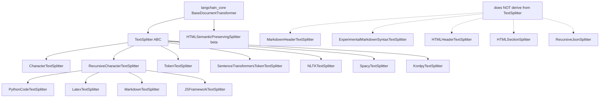

# langchain-text-splitters — Module Inventory

## Module manifest

| Module | LOC | Public surface | Deps (beyond core) | Port class | Priority |
|---|---|---|---|---|---|
| `base.py` | 526 | `TextSplitter` (ABC), `TokenTextSplitter`, `Language` (enum, 28), `Tokenizer` (dataclass), `split_text_on_tokens` | tiktoken (lazy), transformers (lazy) | PORT | P0 |
| `character.py` | 801 | `CharacterTextSplitter`, `RecursiveCharacterTextSplitter`, `_split_text_with_regex`, `get_separators_for_language` | re | PORT | P0 |
| `markdown.py` | 482 | `MarkdownTextSplitter`, `MarkdownHeaderTextSplitter`, `ExperimentalMarkdownSyntaxTextSplitter`, `LineType`, `HeaderType` | re | PORT | P1 |
| `json.py` | 190 | `RecursiveJsonSplitter` | json | PORT | P1 |
| `html.py` | 1,099 | `HTMLHeaderTextSplitter`, `HTMLSectionSplitter`, `HTMLSemanticPreservingSplitter`, `ElementType` | bs4, lxml, nltk (all lazy) | PORT + MAP(parser) | P2 |
| `sentence_transformers.py` | 134 | `SentenceTransformersTokenTextSplitter` | sentence-transformers/torch (lazy) | DEFER/MAP | P3 |
| `jsx.py` | 109 | `JSFrameworkTextSplitter` | re | PORT | P1 |
| `nltk.py` | 83 | `NLTKTextSplitter` | nltk (lazy) | DEFER/MAP | P3 |
| `spacy.py` | 69 | `SpacyTextSplitter` | spacy (lazy) | DEFER/MAP | P3 |
| `konlpy.py` | 45 | `KonlpyTextSplitter` | konlpy (lazy) | DEFER | P4 |
| `python.py` | 17 | `PythonCodeTextSplitter` | — | PORT (trivial) | P1 |
| `latex.py` | 17 | `LatexTextSplitter` | — | PORT (trivial) | P1 |
| `__init__.py` | 99 | re-exports + `__getattr__` lazy loader | importlib | (structure) | P0 |

## Class hierarchy



## Key function catalog (the port-load-bearing internals)

| Symbol | File:lines | Role |
|---|---|---|
| `TextSplitter.__init__` | base.py:62-105 | Validates chunk_size>0, overlap>=0, overlap<=chunk_size; stores 6 config fields |
| `TextSplitter._merge_splits` | base.py:167-209 | **Greedy packer + sliding-window overlap.** THE off-by-one core |
| `TextSplitter._join_docs` | base.py:161-165 | join + optional strip; empty→None |
| `TextSplitter.create_documents` | base.py:118-144 | Per-chunk `start_index` via `text.find(chunk, max(0, offset))` |
| `TextSplitter.from_tiktoken_encoder` | base.py:281-308 | Injects tiktoken length_function |
| `TextSplitter.from_huggingface_tokenizer` | base.py:211-233 | Injects HF `len(tokenize(text))` |
| `split_text_on_tokens` | base.py:498-526 | Token-window slicer; distinct overlap model |
| `Tokenizer` (frozen dataclass) | base.py:481-495 | `{chunk_overlap, tokens_per_chunk, decode, encode}` |
| `_split_text_with_regex` | character.py:64-88 | keep_separator start/end/none split; drops empties |
| `RecursiveCharacterTextSplitter._split_text` | character.py:110-150 | Separator cascade + recursion |
| `get_separators_for_language` | character.py:182-801 | 28-language separator tables |
| `MarkdownHeaderTextSplitter.split_text` | markdown.py:134-280 | Header-stack line state machine |
| `MarkdownHeaderTextSplitter.aggregate_lines_to_chunks` | markdown.py:88-132 | Metadata-run aggregation |
| `RecursiveJsonSplitter._json_split` | json.py:85-114 | Recursive size-bounded dict packer |
| `HTMLHeaderTextSplitter._generate_documents` | html.py:252-367 | DOM DFS + depth-scoped active headers |
| `HTMLSemanticPreservingSplitter._process_html` | html.py:874-1025 | Recursive element walk + placeholder preservation |

## Entry points

- Library import: `langchain_text_splitters/__init__.py` (eager for
  character/base/markdown/json/jsx/latex/python/html; lazy `__getattr__` for
  konlpy/nltk/spacy/sentence_transformers).
- Public per-splitter API: `.split_text(str) -> list[str]` (TextSplitter
  subclasses) or `-> list[Document]` (structure-aware splitters);
  `.create_documents`, `.split_documents`, `.transform_documents`.

## Language-specific constructs needing attention in the port

| Construct | Where | Translation note |
|---|---|---|
| `len` as default length_function | base.py:66 | MUST map to `chars().count()` (code points), not `str::len()` (bytes) |
| `list(text)` on empty separator | character.py:87 | Split on `char` boundaries |
| Python `re` (backtracking, lookaround) | character.py, markdown.py | Rust `regex` crate has NO lookaround; VB6 + custom-header patterns use them → need `fancy-regex` or hand-rolled |
| `str.isprintable` filter | markdown.py:167 | Unicode printable predicate; replicate via `char::is_control`/category check |
| `str.strip()` | base.py:164, throughout | Python strips Unicode whitespace; Rust `trim()` strips Unicode whitespace too — verify set parity |
| `re.split(f"({sep})")` capturing groups | character.py:71-83 | Even/odd index reassembly logic must be reproduced exactly |
| lazy `__getattr__` module loading | __init__.py:91-99 | Rust: cargo features gate optional splitters, not runtime lazy import |
| frozen dataclass `Tokenizer` w/ fn fields | base.py:481-495 | struct holding `Box<dyn Fn>` closures for encode/decode |

## State Checkpoint
```yaml
pass: 5
artifact: module-inventory
package: langchain-text-splitters
status: complete
modules: 13
prod_loc: 3671
timestamp: 2026-07-12
```
